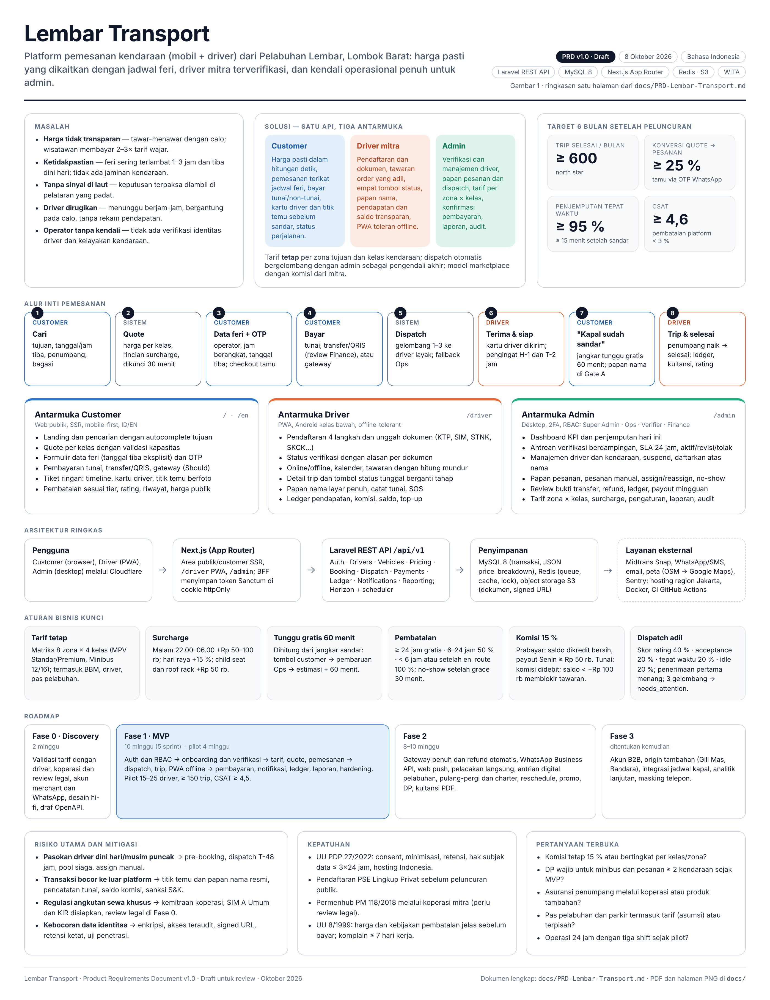

# Lembar Transport — PRD

Dokumen kebutuhan produk (Product Requirements Document) untuk **Lembar Transport**, web app pemesanan kendaraan (mobil + driver) dari **Pelabuhan Lembar, Lombok Barat**. Stack yang ditetapkan: **Laravel** (REST API) · **MySQL** · **Next.js**. Tiga peran: **Customer**, **Driver mitra**, dan **Admin** (verifikasi dan manajemen driver, dispatch, tarif, pembayaran, laporan).

Status: **v1.0 — draft untuk review** (8 Oktober 2026). Bahasa dokumen: Indonesia.

## Isi repositori

| Berkas | Keterangan |
|---|---|
| [`docs/PRD-Lembar-Transport.md`](docs/PRD-Lembar-Transport.md) | PRD lengkap (21 bab + lampiran) dalam Markdown |
| [`docs/PRD-Lembar-Transport.pdf`](docs/PRD-Lembar-Transport.pdf) | PRD yang sama dalam PDF A4 (hasil render) |
| [`docs/png/`](docs/png/) | PRD lengkap per halaman A4 dalam PNG (`PRD-Lembar-Transport-NN.png`) |
| [`docs/img/prd-overview.png`](docs/img/prd-overview.png) | Ringkasan PRD satu halaman (infografis) |
| [`docs/img/`](docs/img/) | Diagram dan wireframe yang disisipkan ke PRD (lihat tabel di bawah) |
| [`tools/prd/`](tools/prd/) | Sumber diagram (HTML + SVG), stylesheet cetak, dan skrip regenerasi |



## Diagram dan wireframe

| Gambar | Berkas | Sumber |
|---|---|---|
| Gambar 1 — Ringkasan PRD satu halaman | `docs/img/prd-overview.png` | `tools/prd/diagrams/prd-overview.html` |
| Gambar 2 — Alur pemesanan customer (swimlane) | `docs/img/flow-customer-booking.png` | `tools/prd/diagrams/flow-customer-booking.html` |
| Gambar 3 — Alur onboarding dan manajemen driver | `docs/img/flow-driver-onboarding.png` | `tools/prd/diagrams/flow-driver-onboarding.html` |
| Gambar 4 — State machine status pesanan | `docs/img/order-state-machine.png` | `tools/prd/diagrams/order-state-machine.html` |
| Gambar 5 — Sitemap per peran | `docs/img/sitemap.png` | `tools/prd/diagrams/sitemap.html` |
| Gambar 6 — Wireframe customer (5 layar) | `docs/img/wireframe-customer.png` | `tools/prd/diagrams/wireframe-customer.html` |
| Gambar 7 — Wireframe driver (6 layar) | `docs/img/wireframe-driver.png` | `tools/prd/diagrams/wireframe-driver.html` |
| Gambar 8 — Wireframe admin (4 layar) | `docs/img/wireframe-admin.png` | `tools/prd/diagrams/wireframe-admin.html` |
| Gambar 9 — Arsitektur sistem | `docs/img/architecture.png` | `tools/prd/diagrams/architecture.html` |
| Gambar 10 — ERD | `docs/img/erd.png` | `tools/prd/diagrams/erd.html` |

## Ringkasan keputusan produk

- **Model bisnis:** managed marketplace; kendaraan milik mitra, platform mengambil komisi (default 15 %), tarif **tetap** per zona tujuan × kelas kendaraan.
- **Mode pemesanan:** pre-booking yang dikaitkan dengan jadwal feri (operator + jam berangkat → estimasi sandar; tombol "Kapal sudah sandar" memulai tunggu gratis 60 menit); order dadakan via QR terminal memakai mesin yang sama.
- **Dispatch:** penawaran otomatis bergelombang ke driver yang layak (skor keadilan, penerimaan pertama menang) dengan admin sebagai fallback (`needs_attention`).
- **Pembayaran:** tunai dan transfer manual (Must); Midtrans Snap (Should); tanpa dompet saldo customer. `payment_status` terpisah dari `status` pesanan.
- **Arsitektur:** satu aplikasi Next.js (area `/`, `/driver` PWA, `/admin`) di atas Laravel REST API `/api/v1` (Sanctum), MySQL 8, Redis, object storage S3-compatible; hosting region Jakarta.
- **Fase:** Fase 0 discovery (2 minggu) → Fase 1 MVP (10 minggu + pilot 4 minggu) → Fase 2 → Fase 3. Rincian di Bab 5 dan 18 PRD.

## Regenerasi dokumen dan gambar

Prasyarat: Node.js ≥ 18 dengan Playwright global dan Chromium (`npm i -g playwright && npx playwright install chromium`), `pandoc`, dan `poppler-utils` (`pdftoppm`, `pdfinfo`).

```bash
bash tools/prd/build.sh                                      # semua: diagram → PNG, PRD → PDF → PNG per halaman
node tools/prd/render.cjs shots tools/prd/diagrams docs/img  # hanya diagram
node tools/prd/render.cjs shot tools/prd/diagrams/erd.html docs/img/erd.png   # satu diagram
```

Setiap diagram adalah berkas HTML mandiri (CSS + SVG inline, font Inter, tanpa ketergantungan jaringan); `tools/prd/diagrams/_lib.js` menyediakan helper kotak, panah, swimlane, dan legenda; `_wire.css` menyediakan gaya wireframe.

## Struktur

```
README.md
docs/
  PRD-Lembar-Transport.md     PRD lengkap
  PRD-Lembar-Transport.pdf    hasil render
  img/                        diagram, wireframe, infografis (PNG, 2x)
  png/                        PRD per halaman A4 (PNG)
tools/prd/
  diagrams/*.html             sumber setiap gambar
  diagrams/_lib.js, _lib.css  helper SVG dan gaya bersama
  diagrams/_wire.css          gaya wireframe
  prd.css                     stylesheet cetak PRD
  render.cjs                  renderer Playwright (screenshot dan PDF)
  build.sh                    pipeline lengkap
```
