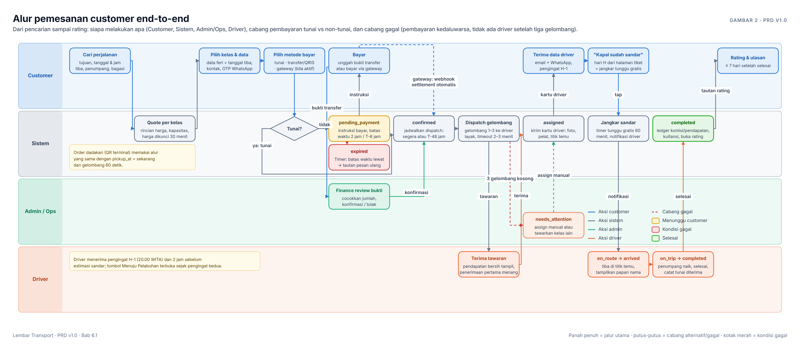
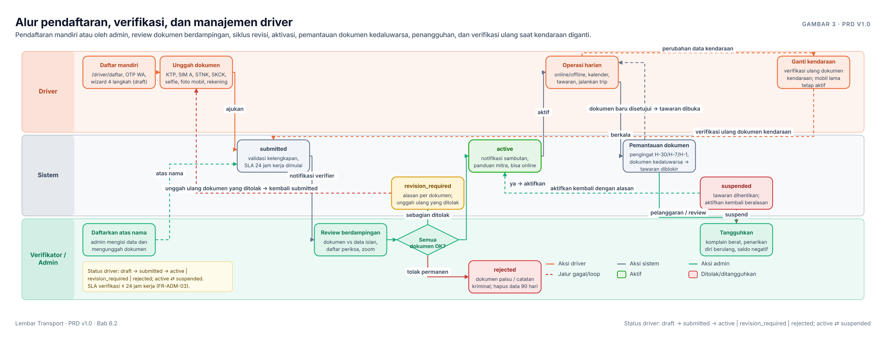
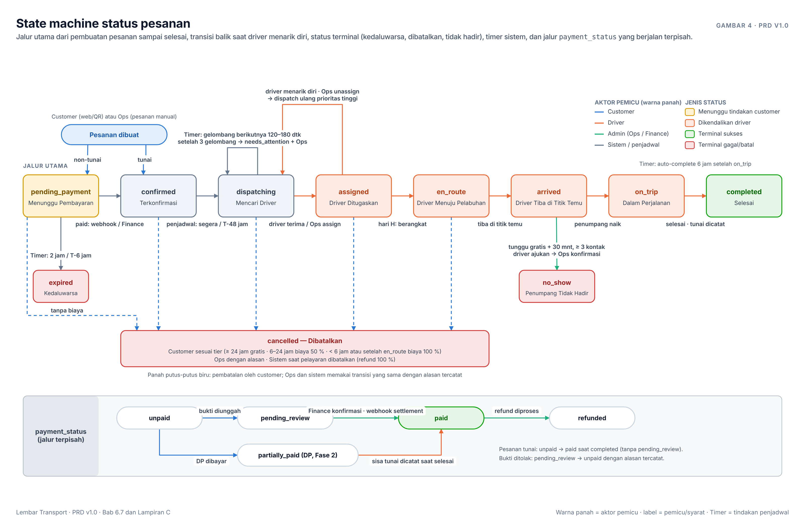
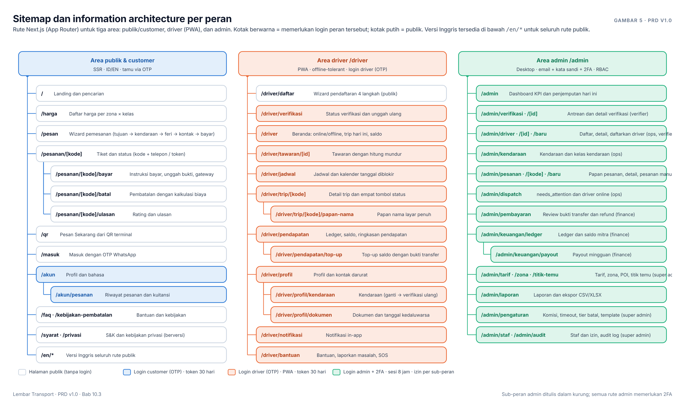
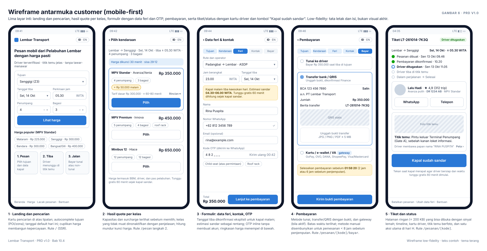
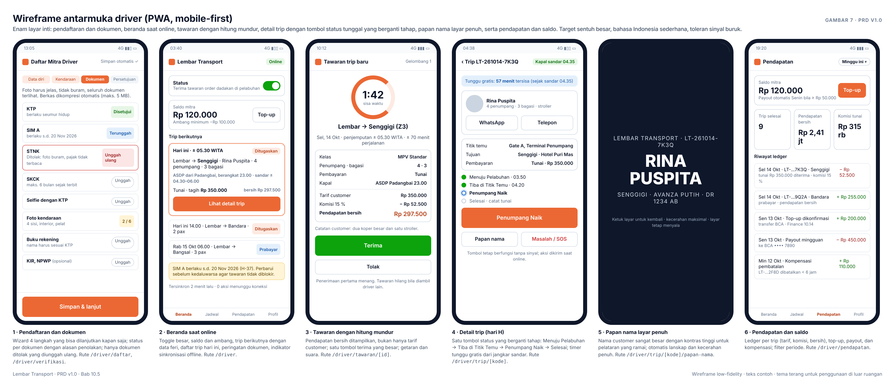
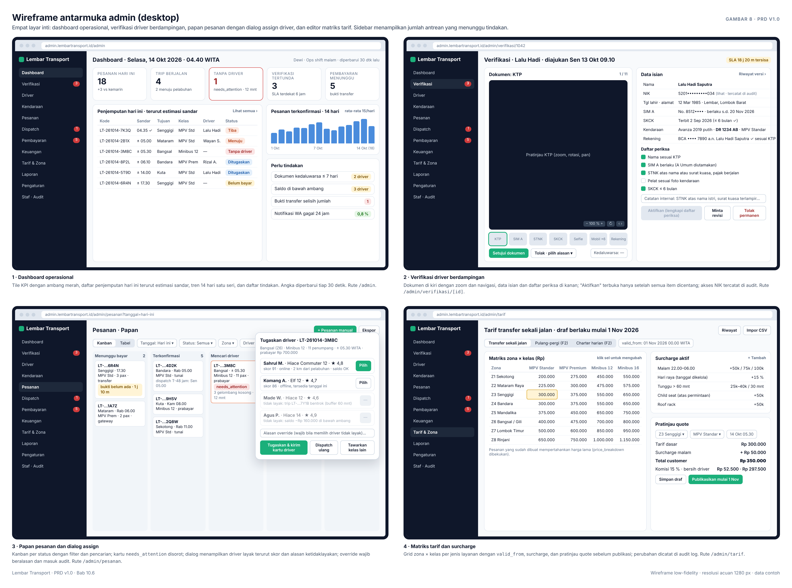
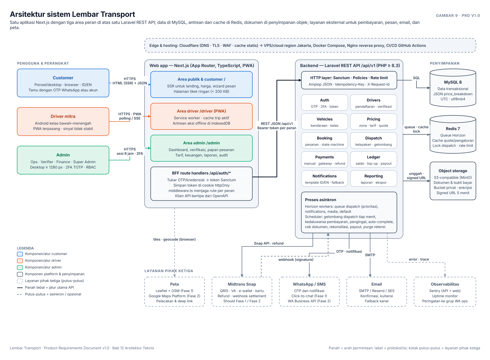
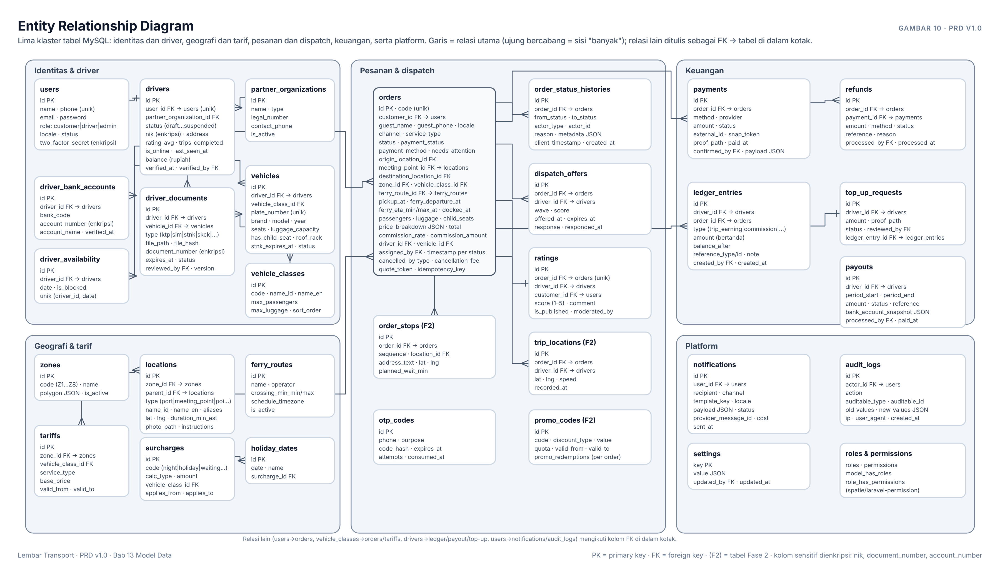

# Lembar Transport — Product Requirements Document (PRD)

**Platform pemesanan kendaraan (mobil + driver) dari Pelabuhan Lembar, Lombok Barat**

| Atribut | Nilai |
|---|---|
| Versi | 1.0 — draft untuk review |
| Tanggal | 8 Oktober 2026 |
| Status | Draft |
| Pemilik dokumen | Tim Produk Lembar Transport |
| Stack | Laravel (REST API, PHP ≥ 8.3) · MySQL 8 · Next.js (App Router, TypeScript) |
| Zona waktu produk | WITA (UTC+8) |
| Bahasa antarmuka | Indonesia (default) dan Inggris |

> Ringkasan visual satu halaman ada pada Gambar 1 (`docs/img/prd-overview.png`). Semua gambar dalam dokumen ini dirender dari sumber HTML di `tools/prd/diagrams/`; cara regenerasi ada di Lampiran E.

## Daftar Isi

1. [Ringkasan Eksekutif](#1-ringkasan-eksekutif)
2. [Konteks Pelabuhan Lembar](#2-konteks-pelabuhan-lembar)
3. [Tujuan, Non-Tujuan, dan Metrik Keberhasilan](#3-tujuan-non-tujuan-dan-metrik-keberhasilan)
4. [Persona dan Peran](#4-persona-dan-peran)
5. [Ruang Lingkup, Asumsi, dan Fase](#5-ruang-lingkup-asumsi-dan-fase)
6. [Alur Pengguna Utama](#6-alur-pengguna-utama)
7. [Kebutuhan Fungsional](#7-kebutuhan-fungsional)
8. [User Story dan Kriteria Penerimaan](#8-user-story-dan-kriteria-penerimaan)
9. [Aturan Bisnis](#9-aturan-bisnis)
10. [Spesifikasi UI](#10-spesifikasi-ui)
11. [Notifikasi dan Komunikasi](#11-notifikasi-dan-komunikasi)
12. [Arsitektur Teknis](#12-arsitektur-teknis)
13. [Model Data](#13-model-data)
14. [Spesifikasi API](#14-spesifikasi-api)
15. [Kebutuhan Non-Fungsional](#15-kebutuhan-non-fungsional)
16. [Kepatuhan, Hukum, dan Privasi](#16-kepatuhan-hukum-dan-privasi)
17. [Analitik dan Pelaporan](#17-analitik-dan-pelaporan)
18. [Roadmap dan Milestone](#18-roadmap-dan-milestone)
19. [Risiko dan Edge Case](#19-risiko-dan-edge-case)
20. [Asumsi, Ketergantungan, dan Pertanyaan Terbuka](#20-asumsi-ketergantungan-dan-pertanyaan-terbuka)
21. [Lampiran](#21-lampiran)

---

## 1. Ringkasan Eksekutif

### 1.1 Masalah

Pelabuhan Lembar adalah gerbang laut utama Pulau Lombok. Setiap hari ribuan penumpang turun dari feri Padangbai (Bali) dan kapal dari Surabaya, sebagian besar tanpa kendaraan lanjutan. Yang mereka temui di pelataran terminal adalah:

- **Harga tidak transparan.** Tarif ditentukan lewat tawar-menawar dengan calo; penumpang yang baru tiba, apalagi wisatawan mancanegara, sering membayar dua hingga tiga kali tarif wajar.
- **Ketidakpastian.** Feri sering terlambat 1–3 jam dan tiba pada dini hari. Tidak ada jaminan kendaraan tersedia, terutama untuk rombongan atau tujuan jauh (Senaru, Sembalun, Bangsal).
- **Tidak ada sinyal di laut.** Penumpang tidak bisa memesan selama penyeberangan, sehingga semua keputusan terpaksa diambil di pelataran yang ramai.
- **Driver dirugikan.** Driver mitra menunggu berjam-jam di pelabuhan, bergantung pada calo yang memotong bagian, dan tidak memiliki rekam jejak order maupun pendapatan.
- **Operator tanpa kendali.** Tidak ada mekanisme verifikasi identitas driver, kelayakan kendaraan, atau penanganan komplain yang terstruktur.

### 1.2 Solusi

**Lembar Transport** adalah platform web full-stack yang terdiri dari tiga antarmuka di atas satu API:

1. **Antarmuka Customer** (web publik, mobile-first, ID/EN): mendapat harga pasti dalam hitungan detik, memesan kendaraan yang dikaitkan dengan jadwal feri, membayar tunai atau non-tunai, menerima data driver dan titik temu sebelum kapal sandar, serta memantau status perjalanan.
2. **Antarmuka Driver** (PWA, mobile-first): mendaftar sebagai mitra, mengunggah dokumen, menerima tawaran order, menjalankan perjalanan dengan empat tombol status besar, dan melihat pendapatan serta saldo komisi secara transparan.
3. **Antarmuka Admin** (web desktop): memverifikasi pendaftaran driver, mengelola driver dan kendaraan, memantau dan mendispatch pesanan, mengatur tarif per zona dan kelas kendaraan, mengonfirmasi pembayaran, dan melihat laporan.

Semua perjalanan menggunakan **tarif tetap** per zona tujuan dan kelas kendaraan yang diatur admin, sehingga tidak ada tawar-menawar. Dispatch dilakukan otomatis secara bergelombang ke driver yang memenuhi syarat, dengan admin sebagai pengendali akhir.

### 1.3 Nilai bagi pemangku kepentingan

| Pemangku kepentingan | Nilai utama |
|---|---|
| Customer | Harga pasti, driver terverifikasi, titik temu jelas, informasi lengkap sebelum sandar, dukungan bahasa Inggris |
| Driver mitra | Order yang adil tanpa potongan calo, jadwal yang bisa direncanakan, pendapatan tercatat, pembayaran non-tunai masuk otomatis |
| Operator / pemilik platform | Kendali kualitas (verifikasi, rating, suspend), data operasional, komisi yang tercatat, kepatuhan terhadap regulasi |
| Pengelola pelabuhan dan pemerintah daerah | Pelataran terminal lebih tertib, pengalaman wisatawan lebih baik |

### 1.4 Target keberhasilan (6 bulan setelah peluncuran publik, indikatif)

| Metrik | Target |
|---|---|
| Trip selesai per bulan (north star) | ≥ 600 |
| Konversi quote → pesanan terkonfirmasi | ≥ 25 % |
| Penjemputan tepat waktu (driver tiba sebelum kapal sandar atau ≤ 15 menit setelahnya) | ≥ 95 % |
| Kepuasan customer (CSAT) | ≥ 4,6 / 5 |
| Tingkat pembatalan oleh platform/driver | < 3 % |
| SLA verifikasi pendaftaran driver | ≤ 24 jam kerja |

### 1.5 Ringkasan teknis dan fase

- **Backend:** Laravel REST API (`/api/v1`), MySQL 8, Redis (queue dan cache), penyimpanan objek S3-compatible untuk dokumen driver, autentikasi Laravel Sanctum.
- **Frontend:** satu aplikasi Next.js (App Router) dengan tiga area: publik/customer (SSR untuk SEO), `/driver` (PWA yang dapat dipasang dan toleran offline), `/admin`.
- **Fase:** Fase 0 Discovery (2 minggu) → Fase 1 MVP (10 minggu) + pilot 4 minggu dengan 15–25 driver dan satu koperasi mitra → Fase 2 (pembayaran online penuh, WhatsApp API, pelacakan langsung, antrian digital, produk pulang-pergi/charter) → Fase 3 (B2B, integrasi jadwal feri, origin tambahan).


*Gambar 1. Ringkasan PRD satu halaman: masalah, solusi, tiga peran, alur inti, arsitektur, fase, dan metrik.*

---

## 2. Konteks Pelabuhan Lembar

### 2.1 Lokasi dan fungsi

Pelabuhan Lembar terletak di Kecamatan Lembar, Kabupaten Lombok Barat, Nusa Tenggara Barat, sekitar 25–30 km di barat daya Kota Mataram. Pelabuhan ini adalah titik masuk laut utama ke Lombok untuk penumpang dari Bali dan Jawa. Area pelabuhan terdiri dari dermaga penyeberangan (dikelola ASDP), terminal penumpang, area parkir, dan Pelabuhan Gili Mas (Pelindo, sekitar 2 km) yang melayani kapal pesiar dan kapal penumpang jarak jauh.

### 2.2 Rute dan pola kedatangan

| Rute | Operator | Frekuensi | Durasi | Catatan desain |
|---|---|---|---|---|
| Padangbai (Bali) → Lembar | ASDP dan operator swasta (kapal ro-ro) | 24 jam, keberangkatan ± tiap 60–90 menit | Jadwal 4–5 jam, aktual sering 5–7 jam karena antrean sandar dan cuaca | Tiket melalui aplikasi Ferizy; mayoritas penumpang pejalan kaki dan sepeda motor |
| Surabaya (Tanjung Perak) → Lembar | Dharma Lautan Utama, ASDP (KMP Legundi) | Beberapa kali per minggu | ± 20–24 jam | Jadwal diumumkan dalam WIB; sistem harus menampilkan WITA |
| Kapal penumpang / pesiar → Gili Mas | Pelni, operator kapal pesiar | Sesekali | — | Origin tambahan untuk Fase 3 |

Pola kedatangan yang memengaruhi produk:

- Kedatangan tersebar sepanjang 24 jam dengan puncak **dini hari** (kapal malam dari Padangbai) dan **sore**.
- Musim puncak: libur Lebaran, Desember–Januari, Juli–Agustus. Pada musim ini pasokan driver di pelabuhan tidak cukup tanpa pre-booking.
- Gangguan cuaca Desember–Februari (gelombang tinggi) dapat menunda atau membatalkan pelayaran; status pelayaran diumumkan oleh Syahbandar.
- Penumpang pejalan kaki keluar melalui terminal ke pelataran yang padat calo; penumpang perlu **titik temu yang jelas** dan **papan nama**.

### 2.3 Implikasi terhadap desain produk

| Fakta lapangan | Keputusan produk |
|---|---|
| Waktu sandar tidak pasti | Pemesanan memakai *operator + jam berangkat* dan menampilkan estimasi sandar sebagai rentang; customer menekan tombol **"Kapal sudah sandar"** yang memulai hitungan waktu tunggu gratis |
| Tidak ada sinyal selama penyeberangan | Semua informasi penting (driver, pelat, titik temu, nomor kontak) dikirim lewat email dan WhatsApp **sebelum** keberangkatan, dan tersedia pada halaman tiket yang ringan |
| Kapal malam tiba dini hari | Formulir meminta **tanggal tiba** secara eksplisit dan menampilkan peringatan untuk keberangkatan setelah pukul 20.00 |
| Kedatangan malam lebih berisiko | Surcharge malam (22.00–06.00) dan driver terverifikasi dengan foto dan pelat yang ditampilkan ke customer |
| Jadwal kapal Surabaya dalam WIB | Semua waktu disimpan dalam UTC dan ditampilkan dalam WITA dengan label zona waktu |
| Pasokan driver tidak merata | Pre-booking sebagai mode utama; dispatch dimulai 48 jam sebelum penjemputan; antrian digital di pelabuhan untuk order dadakan (Fase 2) |

### 2.4 Tujuan populer dan zona tarif (indikatif, divalidasi pada Fase 0)

| Zona | Tujuan yang dicakup | Jarak dari Lembar | Durasi tempuh |
|---|---|---|---|
| Z1 Sekotong | Sekotong, Pelangan, Bangko-Bangko (Desert Point), penyeberangan Gili Nanggu/Gede | 15–45 km | 30–90 menit |
| Z2 Mataram Raya | Mataram, Cakranegara, Ampenan, Terminal Mandalika | 20–30 km | 45–60 menit |
| Z3 Senggigi | Batu Layar, Senggigi, Mangsit, Klui | 35–45 km | 60–80 menit |
| Z4 Bandara | Bandara Internasional Lombok (Praya), Praya kota | 35–40 km | 55–75 menit |
| Z5 Mandalika | Kuta Mandalika, Gerupuk, Selong Belanak, Mawun | 50–60 km | 75–100 menit |
| Z6 Bangsal / Gili | Pelabuhan Bangsal, Teluk Nare, Teluk Kodek (penyeberangan ke Gili Trawangan/Meno/Air) | 55–65 km | 90–120 menit |
| Z7 Lombok Timur | Tetebatu, Selong, Labuhan Lombok / Kayangan | 60–100 km | 90–180 menit |
| Z8 Rinjani | Senaru, Sembalun | 90–130 km | 180–240 menit |
| Lainnya | Alamat bebas di luar zona | — | Quote manual oleh admin |

Catatan: angka jarak dan durasi adalah estimasi berdasarkan kondisi jalan tanpa tol di Lombok dan harus divalidasi bersama 5–10 driver lokal pada Fase 0 sebelum matriks tarif dipublikasikan (lihat Lampiran B).

### 2.5 Pelaku dan alternatif saat ini

- **Calo dan porter** di pelataran terminal: menghubungkan penumpang dengan driver, memotong komisi, harga tidak terstandar.
- **Driver freelance (owner-driver)**: menunggu di pelabuhan tanpa kepastian order; mengandalkan jaringan calo dan pelanggan tetap via WhatsApp.
- **Rental mobil di Mataram**: harus dipesan jauh hari lewat WhatsApp; tidak ada konfirmasi otomatis atau pelacakan.
- **Transportasi daring (ride-hailing)**: ketersediaan di Lembar terbatas, terutama dini hari; bagasi besar dan rombongan sulit dilayani.
- **Angkutan umum**: jarang dan tidak menjangkau tujuan wisata.

---

## 3. Tujuan, Non-Tujuan, dan Metrik Keberhasilan

### 3.1 Tujuan produk

| Kode | Tujuan |
|---|---|
| G1 | Memberikan **kepastian harga dan kendaraan** kepada penumpang sebelum mereka tiba di Lembar |
| G2 | Menyediakan **pasokan driver terverifikasi** melalui proses pendaftaran dan manajemen yang dikendalikan admin |
| G3 | Mendistribusikan order ke driver secara **adil dan cepat** (otomatis dengan kendali admin) |
| G4 | Mencatat seluruh transaksi, komisi, dan status perjalanan secara **transparan** bagi ketiga peran |
| G5 | Memenuhi **regulasi** perlindungan data (UU PDP) dan angkutan sewa khusus melalui mitra koperasi |

### 3.2 Non-tujuan (di luar cakupan dokumen ini)

- Bukan layanan *ride-hailing* instan di seluruh kota; fokusnya adalah perjalanan yang berawal (dan pada Fase 2 berakhir) di Pelabuhan Lembar.
- Tidak menjual tiket feri atau mengintegrasikan pembelian tiket Ferizy.
- Platform tidak memiliki armada sendiri; seluruh kendaraan milik mitra.
- Tidak menyediakan dompet saldo untuk customer (menghindari lisensi uang elektronik Bank Indonesia).
- Tidak membangun aplikasi native Android/iOS pada Fase 1–2; PWA dianggap cukup.

### 3.3 Metrik keberhasilan

| Kategori | Metrik | Target | Cara ukur |
|---|---|---|---|
| North star | Trip selesai per bulan | ≥ 600 (bulan ke-6) | `orders.status = completed` per bulan |
| Akuisisi | Konversi quote → pesanan terkonfirmasi | ≥ 25 % | event `quote_viewed` vs `order_confirmed` |
| Operasional | Waktu dari `confirmed` ke `assigned` (p90) | ≤ 15 menit untuk pre-booking; ≤ 3 menit untuk order dadakan | selisih timestamp riwayat status |
| Operasional | Tingkat penerimaan tawaran oleh driver | ≥ 70 % | `dispatch_offers.response = accepted` / total tawaran |
| Kualitas | Penjemputan tepat waktu | ≥ 95 % | `arrived_at ≤ ferry_docked_at + 15 menit` |
| Kualitas | CSAT (rating 1–5) | ≥ 4,6 | rata-rata `ratings.score` |
| Kualitas | Pembatalan oleh driver/platform | < 3 % | `cancelled_by in (driver, admin)` / pesanan terkonfirmasi |
| Kualitas | No-show customer | < 2 % | `status = no_show` / pesanan terkonfirmasi |
| Pasokan | SLA verifikasi driver | ≤ 24 jam kerja | `submitted_at` → `reviewed_at` |
| Keuangan | Komisi tunai tertagih (setor saldo tepat waktu) | ≥ 97 % | ledger komisi vs top-up |
| Keandalan | Ketersediaan API | ≥ 99,5 %/bulan | uptime monitor |

---

## 4. Persona dan Peran

### 4.1 Persona customer

| Persona | Profil | Tujuan | Frustrasi saat ini | Konteks perangkat |
|---|---|---|---|---|
| **Keluarga domestik** (Rina, 38, dari Denpasar, mudik/liburan dengan 2 anak dan 4 koper) | Menyeberang dengan feri sore, tiba malam | Kendaraan pasti dengan bagasi cukup, harga jelas, driver yang sopan | Tawar-menawar sambil mengurus anak; takut ditipu | Android kelas menengah, kuota terbatas, bahasa Indonesia |
| **Backpacker mancanegara** (Lukas, 27, Jerman, menuju Gili Trawangan) | Tiba dini hari, tidak punya nomor Indonesia aktif | Transfer ke Bangsal yang bisa dibayar kartu, komunikasi bahasa Inggris, titik temu jelas | Tidak tahu harga wajar; tidak bisa dihubungi via telepon lokal | iPhone, hanya Wi-Fi/eSIM, bahasa Inggris, bayar kartu/e-wallet |
| **Pebisnis rutin** (Pak Hendra, 45, Surabaya–Mataram setiap bulan) | Perjalanan berulang, butuh kuitansi | Pemesanan 2 menit, driver tepat waktu, riwayat dan kuitansi | Harus menghubungi rental lewat WhatsApp setiap kali | Android, akun terdaftar, bayar transfer/VA |
| **Rombongan / tour** (Ibu Sari, pemandu wisata, 14 orang) | Butuh minibus dan kadang dua kendaraan | Kapasitas pasti, DP, invoice atas nama agen | Koordinasi beberapa driver lewat telepon | Laptop dan ponsel, pemesanan oleh admin via WhatsApp |

### 4.2 Persona driver

| Persona | Profil | Tujuan | Frustrasi saat ini | Konteks perangkat |
|---|---|---|---|---|
| **Owner-driver** (Pak Lalu, 41, Avanza 2019, tinggal di Lembar) | Menunggu di pelabuhan 8–10 jam per hari | Order teratur tanpa potongan calo, jadwal yang bisa diatur, pembayaran jelas | Pendapatan tidak pasti, sering pulang kosong | Android kelas bawah, sinyal Telkomsel di pelabuhan, literasi digital sedang |
| **Driver rental** (Adi, 29, mengemudi Hiace milik rental di Mataram) | Dipanggil pemilik untuk rombongan | Instruksi jelas (titik temu, jumlah penumpang), kompensasi tunggu | Informasi penumpang tidak lengkap, feri terlambat tanpa kabar | Android, aktif di beberapa grup WhatsApp |

### 4.3 Persona admin

| Peran admin | Tanggung jawab | Kebutuhan utama |
|---|---|---|
| **Super Admin** (pemilik platform) | Konfigurasi tarif, komisi, kebijakan; mengelola staf; melihat seluruh laporan | Kendali penuh, audit log, laporan keuangan |
| **Ops / Dispatcher** (shift 24 jam) | Memantau pesanan hari ini, menangani order yang tidak terambil, assign/reassign manual, membuat pesanan manual dari WhatsApp, menangani keluhan | Papan pesanan langsung, daftar driver online, aksi cepat |
| **Verifikator** | Memeriksa dokumen pendaftaran driver, menyetujui/menolak, memantau dokumen kedaluwarsa | Tampilan dokumen berdampingan, daftar periksa, alasan penolakan bertemplat |
| **Finance** | Mengonfirmasi bukti transfer, rekonsiliasi komisi tunai, memproses payout mingguan, refund | Antrean pembayaran, ledger per driver, ekspor |

### 4.4 Matriks hak akses (RBAC)

Peran teknis pada sistem: `customer`, `driver`, `admin`. Peran `admin` memiliki sub-peran berbasis izin (`super_admin`, `ops`, `verifier`, `finance`) yang dikelola dengan paket izin granular (lihat Bab 12).

| Kemampuan | Customer | Driver | Ops | Verifier | Finance | Super Admin |
|---|---|---|---|---|---|---|
| Melihat harga dan memesan | ✓ | — | ✓ (atas nama customer) | — | — | ✓ |
| Melihat dan membatalkan pesanan sendiri | ✓ | — | ✓ (semua) | — | — | ✓ |
| Mendaftar dan mengunggah dokumen driver | — | ✓ | ✓ (mendaftarkan) | ✓ | — | ✓ |
| Menerima tawaran dan mengubah status trip | — | ✓ | ✓ (override) | — | — | ✓ |
| Memverifikasi dokumen, mengaktifkan/menangguhkan driver | — | — | ✓ (tangguhkan) | ✓ | — | ✓ |
| Assign/reassign driver, membuat pesanan manual | — | — | ✓ | — | — | ✓ |
| Mengonfirmasi pembayaran, refund, payout | — | — | — | — | ✓ | ✓ |
| Mengubah tarif, zona, kelas kendaraan, pengaturan | — | — | — | — | — | ✓ |
| Mengelola staf admin dan izin | — | — | — | — | — | ✓ |
| Melihat laporan | — | ✓ (pendapatan sendiri) | ✓ (operasional) | ✓ (verifikasi) | ✓ (keuangan) | ✓ (semua) |
| Melihat audit log | — | — | — | — | — | ✓ |

---

## 5. Ruang Lingkup, Asumsi, dan Fase

### 5.1 Asumsi dasar

| Kode | Asumsi | Dampak bila salah |
|---|---|---|
| A1 | Mode utama adalah **pre-booking terjadwal** (customer memesan sebelum atau selama di feri), bukan *ride-hailing* instan. Order dadakan di pelabuhan dilayani lewat QR terminal dengan mesin dispatch yang sama | Bila mayoritas order ternyata dadakan, prioritas antrian digital pelabuhan naik ke Fase 1 |
| A2 | Origin tetap **Pelabuhan Lembar** pada Fase 1; perjalanan menuju Lembar pada Fase 2; origin lain (Gili Mas, Bandara) pada Fase 3 | Model tarif perlu matriks asal–tujuan penuh lebih awal |
| A3 | **Marketplace**: kendaraan milik mitra (owner-driver atau rental kecil); platform mengambil komisi (default 15 %, dapat dikonfigurasi) | Bila operator memiliki armada sendiri, perlu modul penjadwalan shift dan perawatan kendaraan |
| A4 | Pembayaran: tunai dan transfer manual wajib ada; gateway Midtrans Snap bila akun merchant siap; **tanpa dompet saldo customer** | Tanpa gateway, pembayaran kartu untuk turis mancanegara tertunda ke Fase 2 |
| A5 | Tidak ada aplikasi native; **PWA Next.js** untuk semua peran | Bila notifikasi push latar belakang di iOS tidak memadai, pertimbangkan wrapper native pada Fase 3 |
| A6 | Posisi hukum: **sewa kendaraan dengan pengemudi** melalui koperasi mitra sesuai Permenhub PM 118/2018; perlu review legal | Persyaratan dokumen driver (KIR, SIM A Umum) dapat berubah dari opsional menjadi wajib |
| A7 | Waktu disimpan UTC dan ditampilkan **WITA** dengan label; jadwal kapal Surabaya dikonversi dari WIB | — |
| A8 | Kanal komunikasi utama **WhatsApp**; Fase 1 memakai OTP via penyedia WhatsApp dan tautan *click-to-chat*, Fase 2 memakai WhatsApp Business API bertemplat | Biaya pesan WA bertemplat memengaruhi unit economics |

### 5.2 Cakupan per fase

| Area | Fase 1 — MVP (10 minggu + pilot 4 minggu) | Fase 2 (8–10 minggu) | Fase 3 (dijadwalkan ulang setelah Fase 2) |
|---|---|---|---|
| Customer | Landing ID/EN, quote instan, pemesanan sekali jalan dari Lembar dengan data feri, checkout tamu via OTP, tunai dan transfer manual (gateway bila siap), halaman tiket dan status, tombol "Kapal sudah sandar", pembatalan, rating, riwayat, halaman harga dan FAQ | Pelacakan langsung dan tautan berbagi perjalanan, pulang-pergi, sewa harian/charter, multi-stop, reschedule mandiri, kode promo, DP untuk rombongan, kuitansi PDF | Akun B2B (agen, hotel) dengan invoice, paket wisata, loyalitas, origin tambahan |
| Driver | Pendaftaran dan unggah dokumen, status verifikasi, profil dan satu kendaraan, online/offline dan kalender, tawaran dengan timer, jadwal, detail trip, empat tombol status, papan nama, pencatatan tunai, ledger dan saldo, top-up manual, mode offline-tolerant, laporan masalah | GPS latar belakang, permintaan payout, multi kendaraan dan co-driver, deep link Google Maps/Waze, SOS, statistik performa, antrian digital pelabuhan | Akun pemilik armada, insentif dan referral, chat in-app |
| Admin | 2FA dan RBAC, dashboard, antrean verifikasi, manajemen driver dan kendaraan, pendaftaran driver oleh admin, papan pesanan, pesanan manual, assign/reassign, pembatalan dan no-show, antrean pembayaran, refund manual, tarif dan surcharge, zona dan titik temu, pengaturan, laporan dan ekspor, ledger dan payout mingguan, staf dan audit log | Penangguhan otomatis dokumen kedaluwarsa, moderasi ulasan, blacklist, tabel jadwal feri dan pengumuman gangguan, promo, batch payout via gateway, disputes, monitor antrian | Analitik lanjutan, integrasi akuntansi, API mitra, multi-port |
| Sistem | Mesin tarif, mesin dispatch bergelombang, penjadwal, riwayat status append-only, notifikasi multi-kanal via queue, penyimpanan dokumen terenkripsi, idempotency, audit log, backup | Webhook gateway dan rekonsiliasi, WhatsApp Business API, web push, geofence pelabuhan | Integrasi jadwal kapal (bila API tersedia), harga dinamis terbatas |

### 5.3 Di luar cakupan (seluruh fase dalam dokumen ini)

Penjualan tiket feri, kepemilikan armada, dompet saldo customer, aplikasi native, layanan antar barang, dan asuransi perjalanan yang dijual platform (asuransi dibahas sebagai pertanyaan terbuka di Bab 20).

### 5.4 Definisi MVP dan gerbang keluar pilot

MVP dinyatakan selesai bila seluruh kebutuhan berprioritas **Must** di Bab 7 lulus kriteria penerimaan di Bab 8, dan pilot 4 minggu mencapai:

- ≥ 15 driver aktif terverifikasi dan ≥ 150 trip selesai;
- acceptance rate tawaran ≥ 60 % dan pesanan `needs_attention` < 10 %;
- CSAT ≥ 4,5 dan tidak ada insiden keamanan data;
- komisi tunai tertagih ≥ 95 %.

---

## 6. Alur Pengguna Utama

### 6.1 Alur pemesanan customer



*Gambar 2. Swimlane alur pemesanan: Customer, Sistem, Admin, Driver, termasuk cabang pembayaran dan cabang gagal (pembayaran kedaluwarsa, tidak ada driver).*

1. **Cari.** Customer membuka landing (ID/EN), memilih tujuan (daftar POI/zona, pencarian teks, atau pin peta), tanggal dan perkiraan jam tiba, jumlah penumpang dan bagasi, serta kebutuhan khusus (child seat, roof rack untuk papan selancar).
2. **Quote.** Sistem menampilkan kartu per kelas kendaraan: harga total, rincian (tarif dasar, surcharge malam/hari raya), kapasitas, estimasi durasi. Kelas yang kapasitasnya tidak cukup ditandai dan disarankan dua kendaraan. Harga dikunci 30 menit lewat *quote token*.
3. **Data feri.** Customer memilih rute dan operator, jam keberangkatan, dan mengonfirmasi **tanggal tiba**. Sistem menampilkan estimasi sandar sebagai rentang (misalnya 04.30–06.00 WITA) dan kebijakan tunggu gratis.
4. **Kontak dan verifikasi.** Nama, nomor WhatsApp (dengan kode negara), email opsional, catatan. OTP 6 digit dikirim via WhatsApp (fallback SMS). Customer yang sudah punya akun dapat masuk.
5. **Pembayaran.** Pilihan: tunai ke driver, transfer bank/QRIS statis (unggah bukti), atau gateway (bila aktif). Metode non-tunai membuat pesanan `pending_payment` dengan batas waktu; tunai langsung `confirmed`.
6. **Konfirmasi.** Halaman tiket dengan kode pesanan (format `LT-YYMMDD-XXXX`), ringkasan, titik temu dengan foto dan instruksi, tautan status. Email dan WhatsApp konfirmasi dikirim.
7. **Dispatch.** Sistem menawarkan pesanan ke driver secara bergelombang (lihat 6.3). Setelah driver menerima, customer menerima kartu driver: foto, nama, pelat, model kendaraan, tombol WhatsApp/telepon.
8. **Hari H.** Customer menerima pengingat; saat kapal sandar, customer menekan **"Kapal sudah sandar"** sehingga driver diberi tahu dan timer tunggu gratis dimulai. Driver menekan "Tiba di Titik Temu" dan menunggu dengan papan nama.
9. **Perjalanan.** Driver menekan "Penumpang Naik" lalu "Selesai" di tujuan. Untuk tunai, driver mencatat jumlah yang diterima.
10. **Pasca-trip.** Customer menerima permintaan rating (≤ 7 hari) dan kuitansi (Fase 2 untuk PDF).

Cabang kegagalan utama: pembayaran tidak diterima sebelum batas → `expired` dan customer diberi tahu untuk memesan ulang; tidak ada driver setelah tiga gelombang → `needs_attention`, admin assign manual atau menawarkan kelas lain; pelayaran dibatalkan → admin menjadwalkan ulang tanpa biaya.

### 6.2 Alur onboarding dan manajemen driver



*Gambar 3. Swimlane onboarding driver: pendaftaran mandiri atau oleh admin, review dokumen, siklus revisi, aktivasi, pemantauan dokumen kedaluwarsa, dan penangguhan.*

1. **Pendaftaran.** Driver membuka `/driver/daftar`, memverifikasi nomor WhatsApp via OTP, lalu mengisi wizard empat langkah: data diri, kendaraan, dokumen, persetujuan (S&K, kebijakan privasi, pernyataan kebenaran data). Wizard dapat disimpan dan dilanjutkan (`draft`). Admin juga dapat mendaftarkan driver atas nama (`FR-ADM-06`).
2. **Pengajuan.** Setelah semua dokumen wajib terunggah, status menjadi `submitted`; verifikator mendapat notifikasi dan SLA 24 jam kerja dimulai.
3. **Review.** Verifikator membuka tampilan berdampingan: gambar dokumen di kiri, data isian di kanan, daftar periksa (nama sesuai KTP, SIM berlaku, STNK atas nama atau surat kuasa, pelat sesuai foto, SKCK ≤ 6 bulan). Setiap dokumen disetujui atau ditolak dengan alasan bertemplat; tanggal kedaluwarsa dicatat.
4. **Keputusan.** Semua dokumen disetujui → `active` dan driver mendapat notifikasi sambutan dengan panduan. Ada dokumen ditolak → `revision_required`; driver hanya mengunggah ulang dokumen yang ditolak. Penolakan permanen (dokumen palsu, catatan kriminal) → `rejected`; data dihapus sesuai retensi (Bab 16).
5. **Operasi.** Driver aktif mengatur ketersediaan, menerima tawaran, menjalankan trip. Rating dan metrik performa terkumpul.
6. **Pemantauan.** Penjadwal mengirim pengingat dokumen H-30/H-7/H-1; dokumen kedaluwarsa memblokir tawaran baru dan (Fase 2) menangguhkan otomatis sampai dokumen baru disetujui. Admin dapat menangguhkan (`suspended`) dengan alasan: komplain berat, penarikan diri berulang, saldo negatif melewati ambang.
7. **Perubahan data.** Penggantian kendaraan atau pelat memerlukan verifikasi ulang dokumen kendaraan; kendaraan lama tetap tersedia sampai yang baru disetujui.

### 6.3 Mesin dispatch bergelombang

**Kelayakan driver untuk sebuah pesanan.** Driver harus memenuhi semuanya: status `active`; tidak ada dokumen wajib yang kedaluwarsa; kelas kendaraan sama dengan pesanan (admin dapat mengizinkan kelas lebih tinggi dengan harga tetap); tidak ada trip lain yang tumpang tindih pada jendela `[pickup_at − 60 menit, pickup_at + estimasi durasi + 60 menit]`; tanggal tidak diblokir di kalender; saldo mitra ≥ ambang (default −Rp 100.000). Untuk order dadakan ditambah: sedang online, `last_seen_at` ≤ 10 menit, dan posisi terakhir dalam radius 3 km dari pelabuhan.

**Pengurutan (skor keadilan).** Rating rata-rata 90 hari (bobot 40 %), acceptance rate 30 hari (20 %), ketepatan waktu (20 %), lama sejak trip terakhir (20 %, mendorong rotasi).

**Gelombang.**

| Jenis pesanan | Kapan dispatch dimulai | Gelombang 1 | Gelombang 2 | Gelombang 3 | Jika tetap kosong |
|---|---|---|---|---|---|
| Pre-booking | Segera bila penjemputan < 48 jam, selain itu pada T-48 jam | 5 driver skor tertinggi, 120 detik | 10 driver berikutnya, 120 detik | Semua yang layak, 180 detik | `needs_attention`, notifikasi ops; sistem mengulang otomatis tiap 30 menit sampai T-6 jam |
| Dadakan (QR terminal) | Segera | Semua driver online di pelabuhan, 60 detik | Online dalam radius 10 km, 60 detik | — | `needs_attention`, ops menawarkan via WhatsApp grup driver |

**Penerimaan.** Penerimaan pertama menang: pembaruan `orders` dilakukan dengan kunci baris dan syarat `status = dispatching`; tawaran lain pada gelombang yang sama otomatis berstatus `superseded` dan layar driver lain menampilkan "Sudah diambil". Penolakan eksplisit menurunkan prioritas driver pada gelombang berikutnya; tidak merespons dihitung sebagai `expired` dan memengaruhi acceptance rate hanya bila driver sedang online.

### 6.4 Eksekusi trip pada hari H

| Waktu | Sistem | Driver | Customer |
|---|---|---|---|
| H-1 pukul 20.00 | Pengingat ke driver dan customer (ringkasan, titik temu) | Memeriksa jadwal esok | Menerima pengingat |
| Estimasi sandar − 2 jam | Pengingat; membuka tombol "Menuju Pelabuhan" | Menekan **Menuju Pelabuhan** (`en_route`) | — |
| Kapal sandar | Mencatat `ferry_docked_at`; memulai timer tunggu gratis 60 menit | Diberi tahu | Menekan **"Kapal sudah sandar"** (bila tidak, sistem memakai estimasi sandar + 60 menit sebagai jangkar; admin dapat memperbarui) |
| Driver di titik temu | Mencatat `arrived_at` (geofence opsional Fase 2) | Menekan **Tiba di Titik Temu** (`arrived`); menampilkan papan nama | Melihat status "Driver sudah menunggu" dan foto titik temu |
| Melewati tunggu gratis | Menghitung biaya tunggu per 30 menit; menandai perlu persetujuan admin | Melihat biaya tunggu berjalan | Diberi tahu biaya tunggu akan ditambahkan |
| Tunggu gratis + 30 menit tanpa kontak | Membuka opsi no-show setelah ≥ 3 upaya kontak tercatat | Mengajukan **no-show** | Diberi tahu; dapat menanggapi |
| Penumpang naik | `on_trip` | Menekan **Penumpang Naik** (PIN 4 digit opsional pada Fase 2) | Tautan pelacakan (Fase 2) |
| Tiba di tujuan | `completed`; ledger diperbarui; membuka rating | Menekan **Selesai**; untuk tunai mengisi jumlah diterima | Menerima permintaan rating dan kuitansi |
| 6 jam setelah `on_trip` tanpa aksi | Auto-complete dan tandai untuk review ops | — | — |

### 6.5 Pembayaran dan settlement

| Metode | Alur | `payment_status` |
|---|---|---|
| Tunai ke driver | Pesanan langsung `confirmed`. Driver mencatat jumlah pada "Selesai". Komisi didebit dari saldo mitra | `unpaid` → `paid` saat selesai |
| Transfer bank / QRIS statis | Pesanan `pending_payment`; customer mengunggah bukti → `pending_review`; Finance mencocokkan jumlah dan mengonfirmasi → `paid` dan pesanan `confirmed`; bukti ditolak → kembali `unpaid` dengan alasan. Batas waktu: 2 jam setelah pemesanan atau T-6 jam, mana yang lebih dulu. Pemesanan < 8 jam sebelum penjemputan hanya menawarkan tunai atau gateway | `unpaid` → `pending_review` → `paid` |
| Gateway (Midtrans Snap) | Snap token dibuat saat checkout; webhook `settlement` mengubah ke `paid` dan `confirmed`; `expire`/`deny` → `expired`; verifikasi tanda tangan dan idempotency; rekonsiliasi harian terhadap laporan gateway | `unpaid` → `paid` |
| DP (Fase 2) | DP 30–50 % via gateway/transfer; sisa tunai ke driver dicatat saat selesai | `partially_paid` → `paid` |

**Settlement ke driver.** Pesanan prabayar: saat `completed`, saldo mitra dikredit `tarif − komisi` dan payout dijalankan setiap Senin untuk saldo ≥ Rp 50.000 ke rekening yang namanya sesuai KTP. Pesanan tunai: saldo didebit sebesar komisi; driver melakukan top-up via transfer (konfirmasi Finance) atau gateway (Fase 2). Saldo di bawah ambang memblokir tawaran baru sampai top-up dikonfirmasi. Biaya tunggu dan surcharge mengikuti porsi komisi yang sama kecuali diatur lain.

### 6.6 Pembatalan, no-show, dan pengecualian

| Skenario | Aturan | Dampak ke driver |
|---|---|---|
| Customer membatalkan ≥ 24 jam sebelum penjemputan | Gratis; refund 100 % (dikurangi biaya gateway bila ada) | Tidak ada |
| Customer membatalkan 6–24 jam sebelumnya | Biaya 50 % | Driver yang sudah ditugaskan menerima 50 % dari porsi bersihnya bila pesanan prabayar |
| Customer membatalkan < 6 jam atau setelah driver `en_route` | Biaya 100 %, tidak ada refund | Driver menerima porsi bersih penuh bila prabayar; untuk tunai admin dapat memberi kompensasi manual |
| No-show (dikonfirmasi admin) | Dianggap biaya 100 % | Sama dengan baris di atas |
| Driver menarik diri | Tanpa biaya bagi customer; pesanan kembali `dispatching` dengan prioritas tinggi; customer diberi tahu hanya bila driver pengganti berbeda | Catatan dan penurunan skor; ≥ 2 kali dalam 30 hari → review dan kemungkinan `suspended` |
| Admin membatalkan (pelayaran batal, force majeure) | Refund 100 %; tawaran reschedule gratis | Tidak ada penalti |
| Kendaraan mogok di tengah perjalanan | Driver melapor via tombol masalah; ops reassign dengan "penyelesaian sebagian"; biaya dibagi manual | Dicatat sebagai insiden |

### 6.7 Siklus status pesanan



*Gambar 4. State machine pesanan dengan aktor pemicu, timer, dan jalur `payment_status` yang terpisah.*

| Status | Label antarmuka (ID) | Arti | Dipicu oleh |
|---|---|---|---|
| `pending_payment` | Menunggu Pembayaran | Pesanan dibuat dengan metode non-tunai | Customer / Admin |
| `confirmed` | Terkonfirmasi | Pembayaran diterima atau metode tunai; menunggu jadwal dispatch | Sistem / Finance |
| `dispatching` | Mencari Driver | Tawaran dikirim bergelombang; dapat berflag `needs_attention` | Sistem / Ops |
| `assigned` | Driver Ditugaskan | Driver menerima atau di-assign admin | Driver / Ops |
| `en_route` | Driver Menuju Pelabuhan | Driver berangkat pada hari H | Driver |
| `arrived` | Driver Tiba di Titik Temu | Driver check-in; timer tunggu berjalan | Driver |
| `on_trip` | Dalam Perjalanan | Penumpang naik | Driver |
| `completed` | Selesai | Tiba di tujuan; tunai dicatat; rating dibuka | Driver / Sistem (auto-complete) |
| `no_show` | Penumpang Tidak Hadir | Customer tidak muncul setelah tunggu gratis dan grace | Driver mengajukan, Ops mengonfirmasi |
| `cancelled` | Dibatalkan | Dibatalkan dengan alasan dan kalkulasi biaya | Customer / Ops / Sistem |
| `expired` | Kedaluwarsa | Pembayaran tidak diterima sebelum batas | Sistem |

`payment_status` berjalan terpisah: `unpaid`, `pending_review`, `partially_paid`, `paid`, `refunded`. Tabel transisi lengkap dengan syarat dan efek samping ada di Lampiran C.

---

## 7. Kebutuhan Fungsional

Prioritas memakai MoSCoW (Must, Should, Could, Won't untuk fase ini). Kolom "Fase" menunjukkan target rilis.

### 7.1 Customer (`FR-CUS`)

| ID | Kebutuhan | Prioritas | Fase |
|---|---|---|---|
| FR-CUS-01 | Landing page ID/EN dengan pemilih tujuan (POI/zona, teks, pin peta), tanggal dan jam tiba, jumlah penumpang dan bagasi, kebutuhan khusus | Must | 1 |
| FR-CUS-02 | Quote instan per kelas kendaraan dengan rincian harga, kapasitas, estimasi durasi; harga dikunci 30 menit via quote token | Must | 1 |
| FR-CUS-03 | Input data feri (rute, operator, jam berangkat, tanggal tiba) dengan estimasi sandar sebagai rentang dan tampilan kebijakan tunggu | Must | 1 |
| FR-CUS-04 | Validasi kapasitas penumpang dan bagasi terhadap kelas kendaraan; saran kelas lebih besar atau dua kendaraan | Must | 1 |
| FR-CUS-05 | Checkout tamu dengan OTP WhatsApp (fallback SMS); opsi membuat akun; login untuk akun terdaftar | Must | 1 |
| FR-CUS-06 | Pembayaran tunai ke driver dan transfer bank/QRIS statis dengan unggah bukti | Must | 1 |
| FR-CUS-07 | Pembayaran via gateway Midtrans Snap (QRIS dinamis, VA, e-wallet, kartu) dengan halaman status otomatis | Should | 1–2 |
| FR-CUS-08 | Halaman tiket/status pesanan (akses via kode pesanan + nomor telepon) dengan timeline, kartu driver, titik temu berfoto, tombol WhatsApp/telepon | Must | 1 |
| FR-CUS-09 | Tombol "Kapal sudah sandar" pada halaman status | Must | 1 |
| FR-CUS-10 | Pembatalan mandiri dengan kalkulasi biaya dan refund sesuai tier | Must | 1 |
| FR-CUS-11 | Notifikasi email dan WhatsApp (tautan) untuk konfirmasi, pembayaran, driver ditugaskan, driver tiba, selesai, pembatalan | Must | 1 |
| FR-CUS-12 | Rating 1–5 dan ulasan setelah trip (≤ 7 hari) | Should | 1 |
| FR-CUS-13 | Riwayat pesanan untuk akun terdaftar; kuitansi PDF | Should | 1 (riwayat), 2 (PDF) |
| FR-CUS-14 | Halaman daftar harga publik per zona × kelas, halaman FAQ, kebijakan pembatalan, S&K, kebijakan privasi | Must | 1 |
| FR-CUS-15 | Order dadakan via QR di terminal ("Pesan Sekarang", penjemputan segera) | Could | 1–2 |
| FR-CUS-16 | Pelacakan posisi driver langsung di peta dan tautan berbagi perjalanan | Should | 2 |
| FR-CUS-17 | Perjalanan pulang-pergi termasuk antar ke Lembar dengan buffer check-in Ferizy | Should | 2 |
| FR-CUS-18 | Sewa harian/charter dan multi-stop | Should | 2 |
| FR-CUS-19 | Reschedule mandiri sesuai kebijakan | Should | 2 |
| FR-CUS-20 | Kode promo dan voucher | Could | 2 |
| FR-CUS-21 | DP untuk rombongan/charter dengan sisa tunai | Should | 2 |
| FR-CUS-22 | Akun B2B (agen/hotel) dengan invoice bulanan dan pemesanan atas nama tamu | Could | 3 |

### 7.2 Driver (`FR-DRV`)

| ID | Kebutuhan | Prioritas | Fase |
|---|---|---|---|
| FR-DRV-01 | Pendaftaran dengan OTP WhatsApp; wizard empat langkah yang dapat disimpan dan dilanjutkan | Must | 1 |
| FR-DRV-02 | Unggah dokumen: KTP, SIM A (A Umum diutamakan), STNK, SKCK, selfie dengan KTP, foto kendaraan (4 sisi, interior, pelat), buku rekening; opsional KIR dan NPWP; kompresi di klien, maksimum 5 MB per berkas; tanggal kedaluwarsa per dokumen | Must | 1 |
| FR-DRV-03 | Layar status verifikasi dengan alasan penolakan per dokumen; unggah ulang hanya dokumen yang ditolak | Must | 1 |
| FR-DRV-04 | Profil dan satu kendaraan aktif; penggantian kendaraan memicu verifikasi ulang | Must | 1 |
| FR-DRV-05 | Toggle online/offline dan kalender tanggal tidak tersedia | Must | 1 |
| FR-DRV-06 | Tawaran order dengan hitung mundur, detail tujuan/waktu/kelas/pendapatan bersih, tombol terima/tolak | Must | 1 |
| FR-DRV-07 | Jadwal hari ini dan mendatang | Must | 1 |
| FR-DRV-08 | Detail trip: customer, penumpang dan bagasi, data feri dan estimasi sandar, titik temu, catatan, metode bayar dan jumlah tunai, kontak via tombol | Must | 1 |
| FR-DRV-09 | Empat tombol status besar (Menuju Pelabuhan, Tiba di Titik Temu, Penumpang Naik, Selesai) dengan konfirmasi untuk aksi tidak dapat dibatalkan | Must | 1 |
| FR-DRV-10 | Papan nama layar penuh berkontras tinggi (nama customer, logo, kode pesanan) | Must | 1 |
| FR-DRV-11 | Pencatatan jumlah tunai yang diterima pada saat Selesai | Must | 1 |
| FR-DRV-12 | Ledger pendapatan per trip dan per periode, komisi, saldo mitra, riwayat top-up | Must | 1 |
| FR-DRV-13 | Top-up saldo via transfer manual dengan unggah bukti | Must | 1 |
| FR-DRV-14 | Mode offline-tolerant: antrean aksi status di IndexedDB, sinkron saat online, indikator koneksi | Must | 1 |
| FR-DRV-15 | Notifikasi: tawaran baru, pengingat H-1 dan 2 jam sebelum sandar, perubahan/pembatalan, kapal sandar, dokumen hampir kedaluwarsa | Must | 1 |
| FR-DRV-16 | Menarik diri dari trip yang sudah diterima dengan alasan; penalti sesuai kebijakan | Must | 1 |
| FR-DRV-17 | Tombol laporkan masalah/SOS ke ops dari detail trip | Should | 1 |
| FR-DRV-18 | Pelacakan GPS latar belakang selama `en_route` sampai `completed` | Should | 2 |
| FR-DRV-19 | Permintaan payout dan riwayat payout (MVP: payout dijadwalkan admin) | Should | 2 |
| FR-DRV-20 | Statistik performa (rating, acceptance, ketepatan waktu) dan program insentif | Could | 2 |

### 7.3 Admin (`FR-ADM`)

| ID | Kebutuhan | Prioritas | Fase |
|---|---|---|---|
| FR-ADM-01 | Login email dan kata sandi dengan 2FA TOTP; sesi 8 jam; RBAC sub-peran | Must | 1 |
| FR-ADM-02 | Dashboard: KPI hari ini (pesanan, trip berjalan, pesanan tanpa driver, verifikasi tertunda, pembayaran menunggu review), daftar penjemputan hari ini terurut estimasi sandar, grafik 14 hari | Must | 1 |
| FR-ADM-03 | Antrean verifikasi: daftar pendaftar, tampilan dokumen berdampingan dengan data isian, zoom, daftar periksa, setujui/tolak per dokumen dengan alasan bertemplat, catatan internal, SLA timer | Must | 1 |
| FR-ADM-04 | Keputusan akhir (aktifkan, minta revisi, tolak) dengan notifikasi otomatis ke driver | Must | 1 |
| FR-ADM-05 | Manajemen driver: tabel dengan status, rating, trip, saldo, dokumen kedaluwarsa; detail; suspend/aktifkan dengan alasan; catatan dan riwayat | Must | 1 |
| FR-ADM-06 | Mendaftarkan driver atas nama (input data dan unggah dokumen oleh admin) | Must | 1 |
| FR-ADM-07 | Manajemen kendaraan dan kelas kendaraan (CRUD, kapasitas, atribut roof rack/child seat) | Must | 1 |
| FR-ADM-08 | Pengingat dokumen kedaluwarsa H-30/H-7/H-1; penangguhan otomatis saat kedaluwarsa | Should | 1 (pengingat), 2 (otomatis) |
| FR-ADM-09 | Papan pesanan (kanban per status) dan tabel dengan filter tanggal, status, zona, driver, metode bayar; pencarian kode/nama/telepon | Must | 1 |
| FR-ADM-10 | Detail pesanan: timeline status, data customer dan feri, pembayaran, driver, log tawaran, aksi | Must | 1 |
| FR-ADM-11 | Pembuatan pesanan manual (dari WhatsApp/telepon) dengan validasi yang sama; override harga dengan alasan | Must | 1 |
| FR-ADM-12 | Assign/reassign manual dengan daftar driver layak (filter kelas, online, jarak, saldo, bentrok jadwal) dan override beralasan | Must | 1 |
| FR-ADM-13 | Memicu ulang dispatch dan menangani antrean `needs_attention` | Must | 1 |
| FR-ADM-14 | Pembatalan oleh admin dengan alasan dan kalkulasi refund; konfirmasi no-show dengan bukti tunggu | Must | 1 |
| FR-ADM-15 | Antrean pembayaran: review bukti transfer, konfirmasi/tolak dengan alasan; tandai tunai diterima | Must | 1 |
| FR-ADM-16 | Pencatatan refund manual (transfer); refund via gateway | Must (manual) | 1, 2 (gateway) |
| FR-ADM-17 | Matriks tarif zona × kelas × jenis layanan dengan `valid_from`, pratinjau quote sebelum publikasi, surcharge (malam, hari raya, tunggu, child seat, roof rack, extra stop) | Must | 1 |
| FR-ADM-18 | Zona dan lokasi (POI) dengan koordinat; titik temu pelabuhan dengan foto dan instruksi ID/EN | Must | 1 |
| FR-ADM-19 | Pengaturan: komisi, timeout tawaran, komposisi gelombang, tunggu gratis, tier pembatalan, ambang saldo, template notifikasi ID/EN | Must | 1 |
| FR-ADM-20 | Laporan: pesanan per hari/zona/kelas, pendapatan dan komisi, kinerja driver, pembatalan/no-show, SLA verifikasi, funnel konversi; ekspor CSV/XLSX | Must | 1 |
| FR-ADM-21 | Ledger dan saldo mitra: lihat, penyesuaian manual beralasan, konfirmasi top-up | Must | 1 |
| FR-ADM-22 | Payout mingguan: daftar saldo positif, ekspor berkas transfer, tandai terbayar | Should | 1 |
| FR-ADM-23 | Manajemen staf admin dan izin; audit log seluruh aksi admin | Must | 1 |
| FR-ADM-24 | Moderasi rating/ulasan dan blacklist nomor telepon customer bermasalah | Should | 2 |
| FR-ADM-25 | Tabel jadwal feri sebagai referensi estimasi sandar dan pengumuman gangguan pelayaran | Should | 2 |
| FR-ADM-26 | Manajemen promo, batch payout otomatis via gateway, penanganan disputes | Could | 2 |
| FR-ADM-27 | Monitor antrian digital pelabuhan | Could | 2 |
| FR-ADM-28 | Analitik lanjutan dan integrasi akuntansi | Could | 3 |

### 7.4 Sistem dan lintas peran (`FR-SYS`)

| ID | Kebutuhan | Prioritas | Fase |
|---|---|---|---|
| FR-SYS-01 | Mesin tarif deterministik berdasarkan matriks aktif pada waktu penjemputan; rincian harga dibekukan pada pesanan | Must | 1 |
| FR-SYS-02 | Mesin dispatch bergelombang dengan kelayakan, skor keadilan, dan penerimaan pertama menang (kunci baris) | Must | 1 |
| FR-SYS-03 | Penjadwal: mulai dispatch T-48 jam, kedaluwarsa pembayaran, pengingat, auto-complete, pemeriksaan dokumen kedaluwarsa, ulang dispatch | Must | 1 |
| FR-SYS-04 | Riwayat status pesanan append-only dengan aktor dan alasan | Must | 1 |
| FR-SYS-05 | Notifikasi multi-kanal via queue dengan template ID/EN, retry, dan fallback kanal | Must | 1 |
| FR-SYS-06 | Penyimpanan dokumen terenkripsi dengan URL bertanda tangan berumur pendek dan kontrol akses per peran | Must | 1 |
| FR-SYS-07 | Idempotency key pada pembuatan pesanan, pembayaran, dan webhook | Must | 1 |
| FR-SYS-08 | Audit log aksi admin dan perubahan tarif/pengaturan | Must | 1 |
| FR-SYS-09 | Webhook gateway dengan verifikasi tanda tangan dan rekonsiliasi harian | Should | 1–2 |
| FR-SYS-10 | Ekspor data subjek dan penghapusan terjadwal sesuai UU PDP | Should | 1 |
| FR-SYS-11 | Backup harian dan point-in-time recovery | Must | 1 |
| FR-SYS-12 | Feature flag untuk fitur Fase 2 agar dapat dirilis bertahap | Should | 1 |

---

## 8. User Story dan Kriteria Penerimaan

Format: *Sebagai [peran], saya ingin [tujuan], sehingga [manfaat]*. Kriteria penerimaan (KP) ditulis ringkas dan dapat diuji; semua waktu dalam WITA.

**US-01 — Quote tanpa login** (FR-CUS-01, 02, 04)
Sebagai customer, saya ingin melihat harga pasti tanpa membuat akun, sehingga saya bisa membandingkan dengan cepat.
- KP1: Harga untuk semua kelas tampil < 1 detik setelah tujuan dan waktu dipilih (p95 API quote ≤ 300 ms).
- KP2: Rincian menampilkan tarif dasar, setiap surcharge yang berlaku, dan total yang dibulatkan ke Rp 1.000.
- KP3: Kelas yang kapasitasnya tidak cukup ditandai "Tidak muat untuk 7 penumpang" dan menawarkan dua kendaraan.
- KP4: Quote token berlaku 30 menit; setelah itu harga dihitung ulang dan customer diberi tahu bila berubah.

**US-02 — Memasukkan data feri** (FR-CUS-03)
Sebagai customer, saya ingin memasukkan kapal dan jam berangkat saya, sehingga driver tahu kapan harus siap meski kapal terlambat.
- KP1: Rute dan jam berangkat wajib; tanggal tiba ditampilkan dan harus dikonfirmasi bila keberangkatan setelah pukul 20.00.
- KP2: Estimasi sandar tampil sebagai rentang berdasarkan durasi rute yang dikonfigurasi admin.
- KP3: Kebijakan tunggu gratis 60 menit sejak sandar tampil di langkah ini dan pada tiket.

**US-03 — Checkout tamu dengan OTP** (FR-CUS-05)
- KP1: OTP 6 digit dikirim via WhatsApp dalam ≤ 10 detik; fallback SMS tersedia setelah 30 detik.
- KP2: Maksimal 3 percobaan per OTP dan 5 permintaan per nomor per jam; OTP berlaku 5 menit.
- KP3: Nomor dengan kode negara non-Indonesia diterima; pesanan terikat pada nomor terverifikasi.

**US-04 — Membayar via transfer manual** (FR-CUS-06, FR-ADM-15)
- KP1: Instruksi rekening/QRIS dan jumlah tepat tampil beserta batas waktu (2 jam atau T-6 jam, mana yang lebih dulu).
- KP2: Unggah bukti (JPG/PNG/PDF ≤ 5 MB) mengubah `payment_status` menjadi `pending_review` dan memberi tahu Finance.
- KP3: Konfirmasi Finance mengubah pesanan menjadi `confirmed` dan mengirim notifikasi ≤ 1 menit; penolakan menyertakan alasan dan membuka unggah ulang.
- KP4: Melewati batas waktu tanpa bukti mengubah pesanan menjadi `expired` dan mengirim tautan pesan ulang.

**US-05 — Membayar via gateway** (FR-CUS-07, FR-SYS-09)
- KP1: Webhook `settlement` yang valid mengubah pesanan menjadi `paid` dan `confirmed`; webhook duplikat tidak membuat efek ganda.
- KP2: Tanda tangan webhook yang tidak valid ditolak dan dicatat.
- KP3: Kedaluwarsa pembayaran mengikuti gateway (≤ 60 menit) dan tidak pernah melewati T-2 jam.

**US-06 — Memilih tunai** (FR-CUS-06)
- KP1: Pesanan tunai langsung `confirmed` dan dispatch dimulai sesuai aturan 6.3.
- KP2: Jumlah yang harus dibayar tampil pada tiket customer dan pada detail trip driver.
- KP3: Admin dapat mewajibkan DP untuk pesanan minibus atau ≥ 2 kendaraan (Fase 2).

**US-07 — Menerima data driver** (FR-CUS-08, 11)
- KP1: Dalam ≤ 1 menit setelah `assigned`, customer menerima email dan WhatsApp berisi nama, foto, pelat, model kendaraan, dan titik temu.
- KP2: Tombol WhatsApp dan telepon ke driver aktif sejak `assigned` sampai 24 jam setelah `completed`.
- KP3: Bila driver diganti, customer menerima kartu driver baru dan kartu lama ditandai tidak berlaku.

**US-08 — Menandai kapal sudah sandar** (FR-CUS-09)
- KP1: Tombol tersedia sejak 2 jam sebelum estimasi sandar sampai pesanan `on_trip`.
- KP2: Menekan tombol mencatat `ferry_docked_at`, memberi tahu driver, dan memulai timer tunggu gratis.
- KP3: Bila tidak ditekan, sistem memakai estimasi sandar + 60 menit; admin dapat menimpa nilai dengan alasan.

**US-09 — Membatalkan pesanan** (FR-CUS-10)
- KP1: Sebelum konfirmasi, layar menampilkan biaya pembatalan dan jumlah refund sesuai tier 6.6.
- KP2: Pesanan menjadi `cancelled` dengan `cancelled_by = customer` dan alasan yang dipilih.
- KP3: Refund gateway diinisiasi otomatis; refund transfer masuk antrean Finance dengan target 3 hari kerja.

**US-10 — Memberi rating** (FR-CUS-12)
- KP1: Tautan rating aktif 7 hari setelah `completed`; satu rating per pesanan.
- KP2: Rating memperbarui rata-rata driver (90 hari) yang dipakai skor dispatch.
- KP3: Ulasan dengan kata terlarang ditahan untuk moderasi (Fase 2).

**US-11 — Mendaftar sebagai driver** (FR-DRV-01, 02)
- KP1: Setiap langkah wizard tersimpan otomatis; driver dapat keluar dan melanjutkan dari perangkat yang sama atau lain setelah OTP.
- KP2: Setiap berkas dikompresi di klien hingga ≤ 5 MB tanpa membuat teks dokumen tidak terbaca (sisi panjang ≥ 1600 px).
- KP3: Pengajuan hanya bisa dilakukan bila semua dokumen wajib ada; status berubah menjadi `submitted` dan SLA dimulai.

**US-12 — Melihat alasan penolakan dan mengunggah ulang** (FR-DRV-03)
- KP1: Setiap dokumen menampilkan status (menunggu, disetujui, ditolak) dan alasan bila ditolak.
- KP2: Hanya dokumen yang ditolak yang dapat diunggah ulang; dokumen yang disetujui terkunci.
- KP3: Riwayat versi dokumen tersimpan untuk audit.

**US-13 — Mengatur ketersediaan** (FR-DRV-05, FR-SYS-02)
- KP1: Tanggal yang diblokir tidak pernah menerima tawaran.
- KP2: Tidak ada tawaran untuk trip yang tumpang tindih dengan trip lain dalam jendela estimasi durasi + 60 menit.
- KP3: Toggle offline menghentikan tawaran dadakan tetapi tidak menghentikan tawaran pre-booking untuk tanggal yang tidak diblokir.

**US-14 — Menerima tawaran dalam batas waktu** (FR-DRV-06, FR-SYS-02)
- KP1: Hitung mundur 120 detik tampil dan tawaran menghilang saat kedaluwarsa atau diambil driver lain.
- KP2: Dua driver yang menerima dalam waktu bersamaan: tepat satu yang menang, yang lain melihat "Sudah diambil" dalam ≤ 2 detik.
- KP3: Tawaran menampilkan pendapatan bersih driver (tarif − komisi), bukan hanya tarif customer.

**US-15 — Menjalankan trip saat sinyal buruk** (FR-DRV-09, 14)
- KP1: Menekan tombol status saat offline menampilkan "Tersimpan, akan dikirim saat online" dan antrean tersinkron otomatis saat koneksi kembali.
- KP2: Urutan status di server divalidasi; aksi yang tiba terlambat dengan stempel waktu klien tetap dicatat dengan waktu klien dan ditandai `synced_late`.
- KP3: Aplikasi tetap dapat dibuka tanpa koneksi untuk trip yang sudah dimuat (cache PWA).

**US-16 — Mencatat tunai dan melihat komisi** (FR-DRV-11, 12)
- KP1: Pada "Selesai" untuk pesanan tunai, jumlah yang diterima wajib diisi (prefilled sesuai tarif) dan selisih > Rp 0 memerlukan alasan.
- KP2: Entri ledger `commission` tercatat ≤ 5 detik setelah selesai dan saldo diperbarui.
- KP3: Saldo di bawah ambang menampilkan banner "Top-up untuk menerima tawaran" dan tawaran baru tidak dikirim.

**US-17 — Memverifikasi driver** (FR-ADM-03, 04)
- KP1: Dokumen dan data isian tampil berdampingan dengan zoom dan rotasi.
- KP2: Setiap item daftar periksa harus dicentang sebelum tombol "Aktifkan" aktif.
- KP3: Keputusan mengirim notifikasi ke driver ≤ 1 menit dan mencatat entri audit (siapa, kapan, alasan).

**US-18 — Membuat pesanan manual** (FR-ADM-11)
- KP1: Formulir memakai validasi dan mesin tarif yang sama dengan customer; override harga memerlukan alasan dan dicatat di audit.
- KP2: Metode bayar manual (tunai/transfer) tersedia; konfirmasi WhatsApp dikirim ke nomor customer.
- KP3: Pesanan manual ditandai `channel = admin` untuk laporan.

**US-19 — Menugaskan ulang setelah driver mundur** (FR-ADM-12, 13)
- KP1: Pesanan kembali `dispatching` dalam ≤ 5 detik setelah driver mundur dan gelombang baru dimulai dengan prioritas tinggi.
- KP2: Dialog assign manual menampilkan driver layak terurut skor dengan alasan ketidaklayakan untuk yang disaring.
- KP3: Customer diberi tahu hanya bila driver berubah setelah kartu driver pernah dikirim.

**US-20 — Mengubah matriks tarif** (FR-ADM-17, FR-SYS-01)
- KP1: Aturan tarif baru memerlukan `valid_from` ≥ sekarang; aturan lama tetap berlaku sampai saat itu.
- KP2: Pesanan yang sudah dibuat mempertahankan `price_breakdown` lama.
- KP3: Pratinjau quote untuk kombinasi zona × kelas tampil sebelum publikasi; publikasi dicatat di audit.

---

## 9. Aturan Bisnis

### 9.1 Kelas kendaraan

| Kode | Nama | Contoh kendaraan | Penumpang (nyaman) | Bagasi (unit koper besar) | Atribut opsional |
|---|---|---|---|---|---|
| `mpv_standard` | MPV Standar | Avanza, Xenia, Ertiga | 4 | 3 | child seat |
| `mpv_premium` | MPV Premium | Innova Reborn, Innova Zenix | 5 | 4 | child seat, roof rack |
| `minibus_12` | Minibus 12 | Hiace Commuter, Elf short | 12 | 12 | roof rack |
| `minibus_16` | Minibus 16 | Hiace Premio, Elf long | 16 | 14 | roof rack |
| `suv_premium` | SUV Premium (Fase 3) | Fortuner, Pajero Sport, Alphard | 4 | 3 | — |

Konversi bagasi: 1 koper besar = 1 unit, koper kabin/ransel = 0,5 unit, papan selancar = perlu atribut roof rack. Usia kendaraan maksimum 10 tahun (dapat dikonfigurasi).

### 9.2 Komposisi harga

`total = tarif_dasar(zona, kelas, jenis_layanan) + surcharge_malam + surcharge_hari_raya + biaya_tambahan − diskon`, dibulatkan ke atas ke kelipatan Rp 1.000. Tarif sudah termasuk BBM, jasa driver, dan pas pelabuhan; tidak termasuk tiket objek wisata, parkir di tujuan, dan biaya makan/penginapan driver untuk charter menginap (Fase 2).

| Komponen | Aturan default (dapat dikonfigurasi admin) |
|---|---|
| Surcharge malam | Berlaku bila estimasi sandar atau `pickup_at` antara 22.00–06.00: MPV Standar +Rp 50.000, MPV Premium +Rp 75.000, Minibus +Rp 100.000 |
| Surcharge hari raya | +15 % pada H-2 sampai H+2 Idulfitri dan 24 Desember–2 Januari; tanggal dikelola admin |
| Biaya tunggu | Gratis 60 menit sejak jangkar sandar; selanjutnya Rp 25.000 per 30 menit (MPV) dan Rp 40.000 per 30 menit (Minibus); memerlukan persetujuan Ops sebelum ditagih |
| Child seat | +Rp 50.000 per kursi, tergantung ketersediaan (ditampilkan sebagai "atas permintaan") |
| Roof rack / papan selancar | +Rp 50.000 per pesanan |
| Pemberhentian tambahan (Fase 2) | +Rp 50.000 per pemberhentian ≤ 15 menit |
| Tujuan di luar zona | Quote manual oleh Ops dalam ≤ 30 menit (jam operasional) |

Draft matriks tarif dasar indikatif ada di Lampiran B dan wajib divalidasi pada Fase 0.

### 9.3 Jangkar waktu tunggu

Prioritas penentuan jangkar: (1) tombol "Kapal sudah sandar" oleh customer, (2) pembaruan manual Ops, (3) estimasi sandar + 60 menit. Jangkar tidak dapat dimundurkan setelah `arrived` tanpa alasan Ops.

### 9.4 Pembatalan dan refund

Tier mengikuti Bab 6.6. Refund gateway diinisiasi otomatis dan mengikuti waktu penyedia (QRIS/e-wallet 1–7 hari kerja, kartu 7–14 hari kerja); refund transfer manual diproses Finance ≤ 3 hari kerja. Biaya gateway yang tidak dikembalikan penyedia tidak di-refund dan dinyatakan sebelum pembayaran.

### 9.5 Komisi, saldo, dan payout

| Aturan | Default |
|---|---|
| Komisi platform | 15 % dari total tarif termasuk surcharge; biaya gateway ditanggung platform dan tidak dikenai komisi |
| Diskon promo (Fase 2) | Ditanggung platform; komisi dihitung dari tarif sebelum diskon |
| Ambang saldo mitra | −Rp 100.000; di bawah itu tawaran baru dihentikan |
| Top-up minimum | Rp 50.000 |
| Payout | Setiap Senin untuk saldo ≥ Rp 50.000 ke rekening atas nama sesuai KTP |
| Penyesuaian manual | Hanya Finance/Super Admin, wajib alasan, tercatat di audit log |

### 9.6 Kelayakan dan sanksi driver

- Dokumen wajib berlaku: SIM A, STNK (pajak berjalan), SKCK (≤ 6 bulan saat pendaftaran); dokumen kedaluwarsa memblokir tawaran.
- Rating rata-rata < 4,0 setelah ≥ 20 trip, atau ≥ 2 penarikan diri dalam 30 hari, atau komplain berat → review Ops; hasil: peringatan, `suspended` sementara, atau `rejected`.
- Driver dilarang menyimpan atau menghubungi customer di luar kebutuhan trip (S&K mitra); pelanggaran berulang → penangguhan.

### 9.7 Perlindungan kontak

Nomor customer ditampilkan penuh ke driver hanya sejak `assigned` sampai 24 jam setelah `completed`; setelah itu hanya 4 digit terakhir. Nomor driver ditampilkan ke customer pada periode yang sama. Fase 3 mengevaluasi proxy nomor (masking telepon).

### 9.8 Operasional

Ops bekerja 24 jam dengan shift; SLA respons untuk pesanan hari H ≤ 10 menit; pesanan `needs_attention` wajib ditangani ≤ 30 menit (pre-booking) atau ≤ 5 menit (dadakan).

---

## 10. Spesifikasi UI

### 10.1 Prinsip desain

1. **Mobile-first** untuk customer dan driver; admin dioptimalkan untuk desktop ≥ 1280 px dan tetap berfungsi di tablet.
2. **Satu aksi utama per layar**; tombol aksi utama selalu terlihat tanpa scroll pada ponsel.
3. **Target sentuh ≥ 44 px**, teks minimum 16 px pada ponsel, kontras ≥ 4,5:1; tema terang default untuk driver di bawah sinar matahari, tema gelap opsional.
4. **Status memakai ikon + label**, tidak pernah warna saja; warna status konsisten di ketiga antarmuka.
5. **Format lokal**: `Rp 250.000`, `Sel, 14 Okt 2026 · 05.30 WITA`, nomor telepon dengan kode negara.
6. **State lengkap** pada setiap layar: kosong (dengan aksi), memuat (skeleton), gagal (dengan solusi), offline (banner dan antrean aksi).
7. **Bahasa** dapat diganti dari header (ID/EN) dan mengikuti preferensi akun.

### 10.2 Sistem desain

Tailwind CSS dengan komponen berbasis Radix (shadcn/ui), ikon Lucide, font Inter. Token warna: `primary` biru laut untuk aksi utama, `accent` oranye untuk elemen driver, status `success/warning/danger/info` tetap. Semua komponen memiliki varian ID/EN melalui kunci pesan, bukan teks tertanam.

### 10.3 Sitemap per peran



*Gambar 5. Peta rute Next.js per peran, batas autentikasi, dan halaman publik vs terproteksi.*

**Rute customer (publik, SSR; versi Inggris di bawah `/en/...`)**

| Rute | Halaman |
|---|---|
| `/` | Landing dan pencarian |
| `/harga` | Daftar harga per zona × kelas |
| `/pesan` | Wizard pemesanan (tujuan → kendaraan → feri → kontak → bayar) |
| `/pesanan/[kode]` | Tiket dan status pesanan (akses dengan kode + nomor telepon) |
| `/pesanan/[kode]/bayar` | Instruksi pembayaran dan unggah bukti |
| `/pesanan/[kode]/batal` | Pembatalan dengan kalkulasi biaya |
| `/pesanan/[kode]/ulasan` | Rating dan ulasan |
| `/qr` | Pesan Sekarang (dari QR terminal) |
| `/masuk`, `/akun`, `/akun/pesanan` | Login, profil, riwayat (akun terdaftar) |
| `/faq`, `/kebijakan-pembatalan`, `/syarat`, `/privasi` | Halaman informasi |

**Rute driver (`/driver`, PWA, memerlukan login driver kecuali pendaftaran)**

| Rute | Halaman |
|---|---|
| `/driver/daftar` | Wizard pendaftaran empat langkah |
| `/driver/verifikasi` | Status verifikasi dan unggah ulang |
| `/driver` | Beranda: toggle online, trip hari ini, saldo, tawaran aktif |
| `/driver/tawaran/[id]` | Detail tawaran dengan hitung mundur |
| `/driver/jadwal` | Jadwal mendatang dan kalender blokir |
| `/driver/trip/[kode]` | Detail trip dan empat tombol status |
| `/driver/trip/[kode]/papan-nama` | Papan nama layar penuh |
| `/driver/pendapatan`, `/driver/pendapatan/top-up` | Ledger, saldo, top-up |
| `/driver/profil`, `/driver/profil/kendaraan`, `/driver/profil/dokumen` | Profil, kendaraan, dokumen |
| `/driver/notifikasi`, `/driver/bantuan` | Notifikasi, bantuan dan SOS |

**Rute admin (`/admin`, memerlukan login admin + 2FA)**

| Rute | Halaman |
|---|---|
| `/admin` | Dashboard |
| `/admin/verifikasi`, `/admin/verifikasi/[id]` | Antrean dan detail verifikasi |
| `/admin/driver`, `/admin/driver/[id]`, `/admin/driver/baru` | Manajemen driver, detail, pendaftaran oleh admin |
| `/admin/kendaraan` | Kendaraan dan kelas kendaraan |
| `/admin/pesanan`, `/admin/pesanan/[kode]`, `/admin/pesanan/baru` | Papan/tabel pesanan, detail, pesanan manual |
| `/admin/dispatch` | Antrean `needs_attention` dan driver online |
| `/admin/pembayaran` | Review bukti transfer dan refund |
| `/admin/keuangan/ledger`, `/admin/keuangan/payout` | Ledger mitra dan payout |
| `/admin/tarif`, `/admin/zona`, `/admin/titik-temu` | Tarif dan surcharge, zona dan POI, titik temu |
| `/admin/laporan` | Laporan dan ekspor |
| `/admin/pengaturan`, `/admin/staf`, `/admin/audit` | Pengaturan, staf dan izin, audit log |

### 10.4 Layar customer



*Gambar 6. Lima layar inti customer: landing dan pencarian, hasil quote, formulir dengan data feri, pembayaran, dan tiket/status.*

| Layar | Elemen utama | State dan aturan khusus |
|---|---|---|
| Landing dan pencarian | Hero dengan kartu pencarian (tujuan, tanggal/jam tiba, penumpang, bagasi), cuplikan harga populer, "Cara kerja" tiga langkah, elemen kepercayaan (driver terverifikasi, harga pasti), toggle ID/EN | Tujuan autocomplete dengan POI dan zona; tanggal default hari ini; validasi inline |
| Hasil quote | Kartu per kelas: foto ilustrasi, kapasitas, harga total, tautan rincian, estimasi durasi, tombol "Pilih" | Kelas tidak muat dinonaktifkan dengan penjelasan; banner surcharge malam bila berlaku; harga terkunci 30 menit dengan penghitung |
| Formulir pemesanan | Bagian feri (rute, operator, jam berangkat, tanggal tiba, estimasi sandar), bagian kontak (nama, WhatsApp, email, catatan), kebutuhan khusus, ringkasan harga menempel di bawah | Peringatan tanggal untuk keberangkatan malam; OTP inline sebelum lanjut; simpan draf lokal |
| Pembayaran | Pilihan metode (tunai, transfer/QRIS, gateway), instruksi dan jumlah tepat, batas waktu, unggah bukti, status otomatis | Hitung mundur batas waktu; metode manual disembunyikan untuk pemesanan < 8 jam sebelum penjemputan |
| Tiket dan status | Kode pesanan, timeline status, kartu driver (foto, nama, pelat, kendaraan, tombol WA/telepon), titik temu dengan foto dan instruksi, tombol "Kapal sudah sandar", aksi batal/ulasan | Halaman ringan (< 200 KB) agar terbuka dengan sinyal lemah; dapat ditambahkan ke layar utama; versi cetak |

### 10.5 Layar driver



*Gambar 7. Enam layar inti driver: pendaftaran dan dokumen, beranda online, tawaran dengan hitung mundur, detail trip dengan tombol status berganti tahap, papan nama layar penuh, serta pendapatan dan saldo.*

| Layar | Elemen utama | State dan aturan khusus |
|---|---|---|
| Pendaftaran dan dokumen | Indikator langkah 1–4, formulir data diri, kendaraan, kartu unggah per dokumen dengan contoh foto yang benar, persetujuan | Simpan otomatis; kompresi gambar; status per dokumen; bahasa Indonesia sederhana |
| Beranda | Toggle Online/Offline besar, kartu "Trip berikutnya", daftar trip hari ini, saldo mitra dan status ambang, tawaran aktif, indikator koneksi | Banner "Top-up untuk menerima tawaran" bila saldo di bawah ambang; banner dokumen hampir kedaluwarsa |
| Tawaran | Hitung mundur melingkar 120 detik, tujuan dan zona, waktu penjemputan dan estimasi sandar, kelas, penumpang dan bagasi, pendapatan bersih, tombol Terima (hijau, besar) dan Tolak | Tawaran hilang bila kedaluwarsa atau diambil; getaran dan suara notifikasi |
| Detail trip | Ringkasan customer dan feri, titik temu, catatan, metode bayar dan jumlah tunai, tombol WA/telepon, tombol status tunggal yang berganti sesuai tahap (Menuju Pelabuhan → Tiba di Titik Temu → Penumpang Naik → Selesai), tautan Papan Nama, tombol Masalah/SOS | Konfirmasi dua langkah untuk "Penumpang Naik" dan "Selesai"; aksi tersimpan saat offline; formulir jumlah tunai pada Selesai |
| Papan nama | Nama customer sangat besar, logo, kode pesanan, latar kontras tinggi, kecerahan maksimal | Orientasi lanskap otomatis; layar tetap menyala |
| Pendapatan dan saldo | Saldo, pendapatan hari ini/minggu ini/bulan ini, daftar ledger per trip (tarif, komisi, bersih), tombol Top-up, riwayat payout | Filter periode; unduh ringkasan (Fase 2) |

### 10.6 Layar admin



*Gambar 8. Empat layar inti admin: dashboard operasional, verifikasi driver berdampingan, papan pesanan dengan dialog assign driver, dan matriks tarif.*

| Layar | Elemen utama | State dan aturan khusus |
|---|---|---|
| Dashboard | Tile KPI (pesanan hari ini, trip berjalan, tanpa driver, verifikasi tertunda, pembayaran menunggu), daftar penjemputan hari ini terurut estimasi sandar dengan status, grafik pesanan 14 hari, pintasan aksi | Angka diperbarui tiap 30 detik; tile merah untuk `needs_attention` > 0 |
| Verifikasi driver | Daftar antrean dengan SLA timer; detail: penampil dokumen (zoom, rotasi, navigasi dokumen) di kiri, data isian dan daftar periksa di kanan, tombol setujui/tolak per dokumen, keputusan akhir, catatan internal | Tombol "Aktifkan" aktif hanya setelah semua item dicentang; alasan penolakan bertemplat ID |
| Papan pesanan | Tab Kanban (kolom per status) dan Tabel; filter tanggal, status, zona, driver, metode bayar; pencarian; badge `needs_attention`; klik membuka panel detail dengan timeline, pembayaran, log tawaran, aksi assign/reassign/batal/no-show | Dialog assign menampilkan driver layak terurut skor dan alasan ketidaklayakan; override memerlukan alasan |
| Pembayaran | Antrean bukti transfer dengan gambar, jumlah pesanan vs jumlah bukti, tombol konfirmasi/tolak; tab refund | Peringatan selisih jumlah; pencocokan otomatis berdasarkan kode pesanan di berita transfer (Fase 2) |
| Tarif | Grid zona × kelas per jenis layanan, editor surcharge, `valid_from`, pratinjau quote, riwayat perubahan | Perubahan ditinjau sebelum publikasi; ekspor/impor CSV |
| Manajemen driver | Tabel dengan filter status, rating, saldo, dokumen; detail dengan tab Profil, Kendaraan, Dokumen, Trip, Ledger, Catatan | Aksi suspend/aktifkan dengan alasan; tanda dokumen kedaluwarsa |
| Laporan, Pengaturan, Staf, Audit | Filter periode dan ekspor; formulir pengaturan dengan validasi; tabel staf dan izin; tabel audit dengan diff | Perubahan pengaturan tercatat di audit |

### 10.7 Komponen bersama

`StatusBadge` (ikon + label + warna), `OrderTimeline`, `DriverCard`, `PriceBreakdown`, `FerryPicker`, `MeetingPointCard`, `DocumentUploader` (kompresi, pratinjau, status), `OfferCountdown`, `TripActionButton`, `NameBoard`, `KpiTile`, `DataTable` (filter, sortir, paginasi server), `DocumentViewer` (split view), `AssignDriverDialog`, `OfflineBanner`, `LocaleSwitcher`.

### 10.8 Responsif dan PWA

- Breakpoint: ≤ 640 px ponsel, 641–1024 px tablet, > 1024 px desktop.
- PWA driver: manifest (ikon, `display: standalone`), service worker (Serwist) dengan cache halaman trip aktif dan antrean aksi di IndexedDB, prompt pasang pada kunjungan kedua, web push pada Fase 2.
- Customer: halaman tiket dapat dipasang dan tetap terbuka offline (data terakhir dari cache).

### 10.9 Aksesibilitas dan i18n

WCAG 2.1 AA (fokus terlihat, label formulir, kontras, navigasi keyboard di admin). Internasionalisasi dengan `next-intl`: rute `/en`, pesan ICU, format tanggal/angka via `Intl`, semua template notifikasi memiliki versi ID dan EN; bahasa Inggris memakai istilah lokal yang dijelaskan (misalnya "Lembar Harbour (ferry port)").

---

## 11. Notifikasi dan Komunikasi

### 11.1 Matriks notifikasi

| Event | Penerima | Kanal Fase 1 | Kanal Fase 2 | Waktu |
|---|---|---|---|---|
| Pesanan dibuat (`pending_payment`) | Customer | Email, WhatsApp (tautan instruksi) | WhatsApp API bertemplat | Segera |
| Bukti transfer diunggah | Finance | In-app, email | Push | Segera |
| Pembayaran dikonfirmasi / pesanan `confirmed` | Customer | Email, WhatsApp | WhatsApp API | ≤ 1 menit |
| Pembayaran ditolak / kedaluwarsa | Customer | Email, WhatsApp | WhatsApp API | Segera |
| Tawaran baru | Driver | In-app (polling/SSE), WhatsApp (tautan) | Push | Segera, per gelombang |
| Driver ditugaskan | Customer | Email, WhatsApp (kartu driver) | WhatsApp API | ≤ 1 menit |
| Pengingat H-1 | Customer, Driver | Email, WhatsApp | WhatsApp API, Push | 20.00 WITA |
| Pengingat 2 jam sebelum estimasi sandar | Driver | In-app, WhatsApp | Push | T-2 jam |
| Kapal sudah sandar | Driver | In-app, WhatsApp | Push | Segera |
| Driver tiba di titik temu | Customer | WhatsApp, email | WhatsApp API | Segera |
| Trip selesai | Customer | Email (kuitansi ringkas), WhatsApp (tautan rating) | WhatsApp API | Segera |
| Pesanan dibatalkan / driver diganti | Customer, Driver | Email, WhatsApp, in-app | WhatsApp API, Push | Segera |
| Pesanan `needs_attention` | Ops | In-app, email, grup WhatsApp ops | Push | Segera dan tiap 30 menit |
| Pendaftaran driver diajukan | Verifier | In-app, email | Push | Segera |
| Dokumen disetujui/ditolak, akun aktif/ditangguhkan | Driver | In-app, WhatsApp, email | WhatsApp API | Segera |
| Dokumen akan kedaluwarsa | Driver, Verifier | In-app, WhatsApp | Push | H-30, H-7, H-1 |
| Saldo di bawah ambang, top-up dikonfirmasi | Driver | In-app, WhatsApp | Push | Segera |
| Payout dikirim | Driver | In-app, WhatsApp | WhatsApp API | Setiap Senin |

### 11.2 Aturan pengiriman

- Semua notifikasi dikirim melalui queue dengan percobaan ulang (3 kali, backoff eksponensial) dan fallback kanal: WhatsApp → SMS (OTP dan tawaran) atau email.
- Template tersedia dalam ID dan EN dan mengikuti bahasa penerima; variabel tidak boleh memuat data sensitif selain yang diperlukan (tidak ada NIK, tidak ada nomor penuh pihak lain di luar jendela kontak).
- Jam tenang tidak berlaku untuk tawaran dan pengingat hari H karena sifat operasi 24 jam; notifikasi pemasaran (Fase 2) menghormati jam tenang 21.00–07.00 dan opt-out.
- Tautan dalam notifikasi memakai token berumur pendek untuk halaman tiket; tidak pernah memuat kredensial.
- Log pengiriman per notifikasi (kanal, status penyedia, biaya) tersimpan 90 hari untuk audit dan analisis biaya.

---

## 12. Arsitektur Teknis

### 12.1 Gambaran umum



*Gambar 9. Satu aplikasi Next.js (tiga area) berkomunikasi dengan Laravel REST API; data di MySQL, antrean dan cache di Redis, dokumen di penyimpanan objek; layanan eksternal untuk pembayaran, WhatsApp/SMS, email, dan peta.*

Prinsip: **satu API untuk tiga antarmuka**, logika bisnis seluruhnya di Laravel, frontend tanpa logika tarif atau dispatch, dan semua proses lambat (notifikasi, pemrosesan berkas, dispatch) berjalan asinkron melalui queue.

### 12.2 Komponen

| Komponen | Teknologi | Tanggung jawab |
|---|---|---|
| Web app | Next.js (App Router, TypeScript, React Server Components), Tailwind, shadcn/ui, TanStack Query, react-hook-form + zod, next-intl, Serwist (PWA) | Area publik/customer (SSR untuk SEO dan kecepatan), area driver (PWA), area admin; BFF tipis untuk menyimpan token di cookie httpOnly |
| API | Laravel (PHP ≥ 8.3), Sanctum, spatie/laravel-permission, spatie/laravel-activitylog, Horizon, Pest, Pint, Scramble/Scribe untuk OpenAPI | Domain: Auth, Drivers, Vehicles, Pricing, Booking, Dispatch, Payments, Ledger, Notifications, Reporting, Admin |
| Basis data | MySQL 8.0 (InnoDB, utf8mb4, zona waktu UTC) | Data transaksional; JSON untuk rincian harga dan payload |
| Cache, queue, lock | Redis 7 | Queue Horizon (`dispatch`, `notifications`, `default`, `media`), cache quote dan pengaturan, rate limiting, lock dispatch |
| Penyimpanan objek | S3-compatible (MinIO self-host untuk MVP, atau layanan cloud) | Dokumen driver, bukti transfer, foto kendaraan dan titik temu; bucket privat, URL bertanda tangan |
| Pembayaran | Midtrans Snap (QRIS, VA, e-wallet, kartu) | Pembayaran online dan refund (Should Fase 1) |
| Pesan | Penyedia WhatsApp (OTP dan notifikasi; WhatsApp Business API pada Fase 2), SMS fallback, email (SMTP/Resend/SES) | OTP, notifikasi transaksional |
| Peta | Leaflet + OpenStreetMap untuk pin dan tampilan; Google Maps Platform untuk pelacakan dan deep link (Fase 2) | Pemilihan lokasi dan pelacakan |
| Observabilitas | Sentry (API dan web), log JSON terstruktur, Horizon dashboard, uptime monitor | Pemantauan dan peringatan ke grup WhatsApp ops |
| Edge dan hosting | Cloudflare (DNS, TLS, WAF, cache statis); VPS/cloud region Jakarta; Docker Compose; Nginx | Hosting di Indonesia untuk kepatuhan dan latensi |

### 12.3 Struktur modul Laravel

```
app/
  Domain/
    Auth/          OTP, token Sanctum, 2FA admin, kebijakan
    Drivers/       pendaftaran, dokumen, verifikasi, status, ketersediaan
    Vehicles/      kendaraan dan kelas kendaraan
    Pricing/       zona, lokasi, tarif, surcharge, QuoteService
    Booking/       pesanan, status, riwayat, pembatalan, no-show
    Dispatch/      kelayakan, skor, gelombang, tawaran, penerimaan
    Payments/      pembayaran manual dan gateway, refund, webhook
    Ledger/        entri ledger, saldo, top-up, payout
    Notifications/ template ID/EN, kanal, fallback, log
    Reporting/     agregasi laporan dan ekspor
  Http/            Controllers per area (Public, Customer, Driver, Admin), Requests, Resources
  Jobs/            StartDispatchWave, ExpireOffers, ExpirePayments, SendNotification, ...
  Console/         penjadwal (schedule:run)
```

Setiap domain memiliki `Actions` (satu kelas per use case), `Models`, `Events`, `Policies`, dan pengujian Pest. Perubahan status pesanan hanya melalui `OrderStateMachine` yang memvalidasi transisi (Lampiran C) dan menulis `order_status_histories`.

### 12.4 Struktur aplikasi Next.js

```
app/
  [locale]/(public)/          landing, harga, pesan, pesanan/[kode], faq, ...
  [locale]/(customer)/akun/   profil dan riwayat (login customer)
  driver/                     PWA driver (locale ID default, EN opsional)
  admin/                      panel admin (desktop)
  api/auth/*                  route handler BFF: tukar OTP/kredensial → cookie httpOnly
features/                     booking, driver, admin (komponen + hooks per fitur)
lib/api/                      klien bertipe dari OpenAPI (openapi-typescript + fetch wrapper)
lib/i18n/                     pesan ID/EN
```

Halaman publik dirender di server (SEO, waktu muat); interaksi (quote, wizard, tawaran) adalah komponen klien dengan TanStack Query. `middleware.ts` menjaga rute per peran berdasarkan cookie sesi dan mengalihkan ke halaman masuk yang sesuai.

### 12.5 Autentikasi dan otorisasi

| Peran | Cara masuk | Token | Masa berlaku |
|---|---|---|---|
| Customer | OTP WhatsApp/SMS (tamu atau akun), opsional kata sandi | Sanctum personal access token dengan ability `customer`, disimpan di cookie httpOnly oleh BFF | 30 hari, diperpanjang saat aktif |
| Driver | OTP WhatsApp | Sanctum token ability `driver` | 30 hari, diperpanjang |
| Admin | Email + kata sandi + TOTP | Sanctum token ability sesuai sub-peran | 8 jam, logout otomatis saat idle 60 menit |

Otorisasi memakai Policy per model dan izin granular (`drivers.verify`, `orders.assign`, `payments.confirm`, `tariffs.manage`, `settings.manage`, `staff.manage`, `reports.view.*`). Halaman tiket customer dapat dibuka tanpa login dengan kode pesanan + 4 digit terakhir nomor telepon atau tautan bertoken berumur pendek.

### 12.6 Konvensi API

- Basis `https://api.<domain>/api/v1`, JSON, UTF-8; waktu ISO 8601 dalam UTC; uang sebagai integer rupiah.
- Amplop sukses `{ "data": ..., "meta": {...}, "links": {...} }`; galat `{ "error": { "code": "ORDER_NOT_CANCELLABLE", "message": "...", "details": [...] } }` dengan kode HTTP yang sesuai (400, 401, 403, 404, 409, 422, 429, 500).
- Paginasi `?page[number]=1&page[size]=25` (maks 100); filter `?filter[status]=assigned&filter[date]=2026-10-14`; sortir `?sort=-pickup_at`; sertakan relasi `?include=driver,vehicle`.
- Header `Idempotency-Key` wajib pada `POST /orders`, `POST /payments`, `POST /driver/top-ups`; kunci disimpan 24 jam dan mengembalikan respons yang sama untuk permintaan ulang.
- Header `Accept-Language: id|en` menentukan bahasa pesan galat dan label.
- Rate limit per kelompok: publik 60/menit per IP, OTP 5/jam per nomor, driver 120/menit per token, admin 300/menit per token.
- Setiap respons membawa `X-Request-Id` untuk korelasi log.

### 12.7 Komunikasi waktu nyata

Fase 1: polling ringan (driver online memeriksa tawaran tiap 10 detik; papan admin tiap 30 detik) dan endpoint SSE opsional `GET /driver/offers/stream`. Fase 2: WebSocket melalui Laravel Reverb untuk tawaran, pelacakan posisi, dan papan admin langsung.

### 12.8 Penyimpanan berkas

Bucket privat dengan enkripsi sisi server; jalur `drivers/{driver_id}/documents/{type}/{uuid}.{ext}`, `orders/{order_id}/payment-proofs/{uuid}.{ext}`. Akses hanya melalui URL bertanda tangan berumur 5 menit yang diterbitkan API sesuai izin peran. Thumbnail dibuat di queue `media`. Pemindaian malware (ClamAV) direkomendasikan pada Fase 2. Retensi mengikuti Bab 16.

### 12.9 Queue dan penjadwal

| Pekerjaan | Jadwal/pemicu | Queue |
|---|---|---|
| `StartDispatchWave`, `ExpireOffers`, `RetryDispatch` | Setiap menit untuk pesanan `dispatching` | `dispatch` (prioritas tinggi) |
| `ExpirePendingPayments` | Setiap 5 menit | `default` |
| `SendNotification` (dengan fallback kanal) | Event domain | `notifications` |
| `GenerateThumbnails`, `CompressProof` | Unggah berkas | `media` |
| `SendDayBeforeReminders` | Harian 20.00 WITA | `notifications` |
| `SendPreArrivalReminders` | Setiap 10 menit | `notifications` |
| `AutoCompleteStaleTrips` | Setiap 30 menit | `default` |
| `CheckDocumentExpiry` | Harian 06.00 WITA | `default` |
| `ReconcileGatewayTransactions` | Harian 02.00 WITA | `default` |
| `PrepareWeeklyPayouts` | Senin 07.00 WITA | `default` |
| `PurgeExpiredData` (retensi UU PDP) | Harian 03.00 WITA | `default` |
| Backup basis data | Harian 01.00 WITA + binlog | sistem |

### 12.10 Lingkungan dan deployment

- **Lingkungan:** lokal (Docker Compose/Laravel Sail), staging (data sintetis, gateway sandbox, nomor WhatsApp uji), produksi.
- **Produksi MVP:** satu VPS 4 vCPU/8 GB di region Jakarta dengan kontainer `nginx`, `php-fpm`, `horizon`, `scheduler`, `nextjs`, `mysql`, `redis`, `minio`; dapat dipisah ke layanan terkelola (MySQL, Redis, S3) tanpa perubahan kode.
- **CI/CD (GitHub Actions):** lint (Pint, ESLint, TypeScript), uji (Pest dengan MySQL service, Vitest, Playwright e2e untuk alur kritis), build image ke GHCR, deploy ke staging otomatis dan ke produksi dengan persetujuan manual; migrasi dijalankan sebelum pergantian kontainer dengan mode pemeliharaan singkat.
- **Konfigurasi:** seluruh rahasia melalui variabel lingkungan; tidak ada kredensial di repositori; kunci enkripsi aplikasi dirotasi sesuai kebijakan.

### 12.11 Observabilitas

Sentry untuk galat API dan web (dengan `X-Request-Id`), log JSON terstruktur dengan retensi 30 hari, dashboard Horizon untuk antrean, metrik bisnis (waktu dispatch, acceptance rate, kegagalan webhook, kegagalan notifikasi) di dashboard admin, uptime monitor eksternal dengan peringatan ke grup WhatsApp ops dan email.

---

## 13. Model Data

### 13.1 Diagram relasi entitas



*Gambar 10. ERD dengan lima klaster: identitas dan driver, geografi dan tarif, pesanan dan dispatch, keuangan, serta platform.*

### 13.2 Kamus data (tabel dan kolom utama)

Semua tabel memiliki `id` (BIGINT auto-increment), `created_at`, `updated_at`; kolom sensitif ditandai **(enkripsi)**. Tipe `enum` diimplementasikan sebagai `VARCHAR` dengan validasi di aplikasi agar mudah berevolusi.

**Klaster identitas dan driver**

| Tabel | Kolom utama |
|---|---|
| `users` | `name`, `email` (unik, nullable), `phone` (unik, E.164), `phone_verified_at`, `password` (nullable), `role` (`customer`/`driver`/`admin`), `locale`, `status`, `two_factor_secret` (enkripsi), `last_login_at`, `deleted_at` |
| `roles`, `permissions`, pivot | Paket spatie/laravel-permission untuk sub-peran admin dan izin granular |
| `partner_organizations` | `name`, `type` (`koperasi`/`rental`), `legal_number`, `contact_phone`, `address`, `is_active` |
| `drivers` | `user_id` (unik), `partner_organization_id` (nullable), `status` (`draft`/`submitted`/`revision_required`/`active`/`suspended`/`rejected`/`inactive`), `nik` (enkripsi), `birth_date`, `address`, `emergency_contact_name`, `emergency_contact_phone`, `is_online`, `last_seen_at`, `last_lat`, `last_lng`, `rating_avg`, `rating_count`, `trips_completed`, `acceptance_rate_30d`, `on_time_rate_90d`, `balance` (rupiah, bisa negatif), `submitted_at`, `verified_at`, `verified_by`, `suspended_at`, `suspension_reason`, `notes` |
| `driver_documents` | `driver_id`, `vehicle_id` (nullable), `type` (`ktp`/`sim`/`stnk`/`skck`/`kir`/`selfie_ktp`/`vehicle_photo`/`bank_account`/`npwp`), `file_path`, `file_hash`, `document_number` (enkripsi), `issued_at`, `expires_at`, `status` (`pending`/`approved`/`rejected`/`expired`), `reviewed_by`, `reviewed_at`, `rejection_reason_code`, `rejection_note`, `version` |
| `driver_bank_accounts` | `driver_id`, `bank_code`, `account_number` (enkripsi), `account_name`, `verified_at` |
| `driver_availability` | `driver_id`, `date`, `is_blocked`, `note`; unik (`driver_id`, `date`) |
| `vehicle_classes` | `code`, `name_id`, `name_en`, `example_vehicles`, `max_passengers`, `max_luggage`, `sort_order`, `is_active` |
| `vehicles` | `driver_id`, `vehicle_class_id`, `brand`, `model`, `year`, `plate_number` (unik), `color`, `seats`, `luggage_capacity`, `has_child_seat`, `has_roof_rack`, `stnk_expires_at`, `kir_expires_at`, `status` (`pending`/`active`/`inactive`), `is_primary` |

**Klaster geografi dan tarif**

| Tabel | Kolom utama |
|---|---|
| `zones` | `code` (Z1…Z8), `name`, `description`, `sort_order`, `is_active`, `polygon` (JSON, nullable) |
| `locations` | `zone_id` (nullable), `parent_id` (nullable, untuk titik temu di dalam pelabuhan), `type` (`port`/`meeting_point`/`poi`/`airport`/`harbor`/`area`), `name_id`, `name_en`, `aliases` (JSON), `lat`, `lng`, `distance_km_est`, `duration_min_est`, `photo_path`, `instructions_id`, `instructions_en`, `is_origin`, `is_active` |
| `ferry_routes` | `name`, `operator`, `origin_port`, `crossing_min_min`, `crossing_min_max`, `schedule_timezone` (`WIB`/`WITA`), `is_active` |
| `tariffs` | `zone_id`, `vehicle_class_id`, `service_type` (`transfer_oneway`/`transfer_roundtrip`/`charter_daily`), `base_price`, `valid_from`, `valid_to` (nullable), `created_by`; unik (`zone_id`, `vehicle_class_id`, `service_type`, `valid_from`) |
| `surcharges` | `code` (`night`/`holiday`/`waiting`/`child_seat`/`roof_rack`/`extra_stop`), `name_id`, `name_en`, `calc_type` (`flat`/`percent`/`per_unit`), `amount`, `unit_minutes`, `vehicle_class_id` (nullable), `applies_from`, `applies_to`, `is_active` |
| `holiday_dates` | `date`, `name`, `surcharge_id` |

**Klaster pesanan dan dispatch**

| Tabel | Kolom utama |
|---|---|
| `orders` | `code` (`LT-YYMMDD-XXXX`, unik), `customer_id` (nullable), `guest_name`, `guest_phone`, `guest_email`, `locale`, `channel` (`web`/`qr`/`admin`), `service_type`, `status` (Bab 6.7), `payment_status`, `payment_method` (`cash`/`bank_transfer`/`gateway`), `needs_attention`, `origin_location_id`, `meeting_point_id`, `destination_location_id` (nullable), `destination_text`, `destination_lat`, `destination_lng`, `zone_id`, `vehicle_class_id`, `pickup_at`, `ferry_route_id`, `ferry_departure_at`, `ferry_eta_min_at`, `ferry_eta_max_at`, `ferry_docked_at`, `docked_source` (`customer`/`admin`/`estimate`), `passengers`, `luggage_units`, `child_seats`, `needs_roof_rack`, `notes`, `price_breakdown` (JSON), `subtotal`, `surcharge_total`, `discount_total`, `waiting_fee`, `total`, `commission_rate`, `commission_amount`, `driver_payout_amount`, `driver_id`, `vehicle_id`, `assigned_by`, `assigned_at`, `en_route_at`, `arrived_at`, `on_trip_at`, `completed_at`, `cancelled_at`, `cancelled_by_type`, `cancellation_reason`, `cancellation_fee`, `quote_token`, `idempotency_key`, `created_by` |
| `order_stops` (Fase 2) | `order_id`, `sequence`, `location_id`, `address_text`, `lat`, `lng`, `planned_wait_min` |
| `order_status_histories` | `order_id`, `from_status`, `to_status`, `actor_type` (`customer`/`driver`/`admin`/`system`), `actor_id`, `reason`, `metadata` (JSON), `client_timestamp`, `created_at`; append-only |
| `dispatch_offers` | `order_id`, `driver_id`, `wave`, `score`, `offered_at`, `expires_at`, `response` (`pending`/`accepted`/`declined`/`expired`/`superseded`), `responded_at` |
| `ratings` | `order_id` (unik), `driver_id`, `customer_id` (nullable), `score` (1–5), `comment`, `is_published`, `moderated_by` |
| `trip_locations` (Fase 2) | `order_id`, `driver_id`, `lat`, `lng`, `speed`, `recorded_at` |

**Klaster keuangan**

| Tabel | Kolom utama |
|---|---|
| `payments` | `order_id`, `method`, `provider` (`manual`/`midtrans`), `amount`, `status` (`pending`/`pending_review`/`paid`/`failed`/`expired`/`rejected`), `external_id`, `snap_token`, `proof_path`, `paid_at`, `confirmed_by`, `confirmed_at`, `rejection_reason`, `payload` (JSON) |
| `refunds` | `order_id`, `payment_id`, `amount`, `method`, `status` (`pending`/`processed`/`failed`), `reference`, `reason`, `processed_by`, `processed_at` |
| `ledger_entries` | `driver_id`, `order_id` (nullable), `type` (`trip_earning`/`commission`/`waiting_fee`/`cancellation_compensation`/`top_up`/`payout`/`adjustment`), `amount` (bertanda), `balance_after`, `reference_type`, `reference_id`, `note`, `created_by`; append-only |
| `top_up_requests` | `driver_id`, `amount`, `proof_path`, `status` (`pending_review`/`confirmed`/`rejected`), `reviewed_by`, `reviewed_at`, `ledger_entry_id` |
| `payouts` | `driver_id`, `period_start`, `period_end`, `amount`, `bank_account_snapshot` (JSON), `status` (`pending`/`paid`/`failed`), `reference`, `paid_at`, `processed_by` |

**Klaster platform**

| Tabel | Kolom utama |
|---|---|
| `otp_codes` | `phone`, `code_hash`, `purpose`, `expires_at`, `attempts`, `consumed_at` |
| `notifications` | `user_id` (nullable), `recipient`, `channel` (`email`/`whatsapp`/`sms`/`in_app`/`push`), `template_key`, `locale`, `payload` (JSON), `status` (`queued`/`sent`/`delivered`/`failed`), `provider_message_id`, `cost`, `sent_at` |
| `settings` | `key` (unik), `value` (JSON), `updated_by` |
| `audit_logs` | `actor_id`, `action`, `auditable_type`, `auditable_id`, `old_values` (JSON), `new_values` (JSON), `ip`, `user_agent`, `created_at` |
| `promo_codes`, `promo_redemptions` (Fase 2) | kode, tipe diskon, kuota, periode, pemakaian per pesanan |
| `port_queue_entries` (Fase 2) | `driver_id`, `vehicle_class_id`, `checked_in_at`, `position`, `status` |

### 13.3 Indeks dan integritas

- Indeks komposit `orders (status, pickup_at)`, `orders (driver_id, pickup_at)`, `orders (guest_phone, created_at)`, `dispatch_offers (order_id, response)`, `driver_documents (driver_id, type, status)`, `ledger_entries (driver_id, created_at)`.
- Kunci asing dengan `ON DELETE RESTRICT` untuk data transaksional; penghapusan pengguna memakai soft delete dan anonimisasi (Bab 16).
- `orders.price_breakdown` dibekukan saat pesanan dibuat; perubahan tarif tidak memengaruhi pesanan lama.
- Saldo `drivers.balance` selalu sama dengan jumlah `ledger_entries.amount`; pekerjaan harian memverifikasi dan melaporkan selisih.

---

## 14. Spesifikasi API

Semua endpoint berada di bawah `/api/v1`. Kolom **Auth**: `—` publik, `C` customer, `D` driver, `A` admin (dengan izin yang disebut), `W` webhook (tanda tangan penyedia).

### 14.1 Publik dan autentikasi

| Metode | Endpoint | Deskripsi | Auth |
|---|---|---|---|
| GET | `/public/vehicle-classes` | Daftar kelas kendaraan aktif | — |
| GET | `/public/zones` | Zona beserta tujuan populer | — |
| GET | `/public/locations?q=` | Pencarian tujuan (POI/zona/alias) | — |
| GET | `/public/ferry-routes` | Rute feri dan rentang durasi | — |
| GET | `/public/meeting-points` | Titik temu di pelabuhan dengan foto | — |
| POST | `/public/quotes` | Hitung harga per kelas; mengembalikan `quote_token` (30 menit) | — |
| GET | `/public/tariffs` | Daftar harga publik per zona × kelas | — |
| POST | `/auth/otp/request` | Kirim OTP ke nomor (WhatsApp, fallback SMS) | — |
| POST | `/auth/otp/verify` | Verifikasi OTP; mengembalikan token sesuai peran | — |
| POST | `/auth/admin/login` | Login admin (email, kata sandi) → tantangan TOTP | — |
| POST | `/auth/admin/totp` | Verifikasi TOTP; mengembalikan token admin | — |
| POST | `/auth/logout` | Cabut token | C/D/A |
| GET | `/auth/me` | Profil dan izin pengguna saat ini | C/D/A |

### 14.2 Customer

| Metode | Endpoint | Deskripsi | Auth |
|---|---|---|---|
| POST | `/orders` | Buat pesanan dari `quote_token` + data feri + kontak + metode bayar (`Idempotency-Key`) | C atau OTP tamu |
| GET | `/orders/{code}` | Detail pesanan untuk pemilik (token atau kode + 4 digit telepon) | C/token tiket |
| GET | `/orders` | Riwayat pesanan akun | C |
| POST | `/orders/{code}/payment-proof` | Unggah bukti transfer | C/token tiket |
| POST | `/orders/{code}/gateway-session` | Buat Snap token gateway | C/token tiket |
| POST | `/orders/{code}/docked` | Tandai kapal sudah sandar | C/token tiket |
| POST | `/orders/{code}/cancel` | Batalkan dengan alasan; mengembalikan rincian biaya dan refund | C/token tiket |
| GET | `/orders/{code}/cancellation-preview` | Pratinjau biaya pembatalan | C/token tiket |
| POST | `/orders/{code}/rating` | Kirim rating dan ulasan | C/token tiket |
| GET | `/orders/{code}/receipt` | Kuitansi (PDF pada Fase 2) | C/token tiket |
| PATCH | `/me` | Perbarui profil dan bahasa | C |

### 14.3 Driver

| Metode | Endpoint | Deskripsi | Auth |
|---|---|---|---|
| POST | `/driver/applications` | Mulai pendaftaran (status `draft`) | D (OTP) |
| PATCH | `/driver/applications/current` | Simpan langkah wizard | D |
| POST | `/driver/documents` | Unggah dokumen (multipart, tipe, tanggal kedaluwarsa) | D |
| POST | `/driver/applications/current/submit` | Ajukan verifikasi | D |
| GET | `/driver/me` | Profil, status verifikasi, saldo, kendaraan | D |
| GET | `/driver/documents` | Status setiap dokumen dan alasan penolakan | D |
| POST | `/driver/vehicles` · PATCH `/driver/vehicles/{id}` | Tambah/ubah kendaraan (memicu verifikasi ulang) | D |
| PATCH | `/driver/availability` | Toggle online/offline, kirim posisi terakhir | D |
| PUT | `/driver/blocked-dates` | Kalender tanggal diblokir | D |
| GET | `/driver/offers` | Tawaran aktif | D |
| GET | `/driver/offers/stream` | SSE tawaran (opsional) | D |
| POST | `/driver/offers/{id}/accept` · `/decline` | Respons tawaran (penerimaan pertama menang) | D |
| GET | `/driver/trips?date=` | Jadwal trip | D |
| GET | `/driver/trips/{code}` | Detail trip | D |
| POST | `/driver/trips/{code}/status` | `en_route` / `arrived` / `on_trip` / `completed` dengan `client_timestamp`, `cash_collected`, `cash_note` | D |
| POST | `/driver/trips/{code}/no-show` | Ajukan no-show dengan log upaya kontak | D |
| POST | `/driver/trips/{code}/withdraw` | Menarik diri dengan alasan | D |
| POST | `/driver/trips/{code}/issues` | Laporkan masalah/SOS | D |
| POST | `/driver/locations` (Fase 2) | Batch posisi GPS | D |
| GET | `/driver/ledger?period=` | Ledger, saldo, ringkasan pendapatan | D |
| POST | `/driver/top-ups` | Ajukan top-up dengan bukti (`Idempotency-Key`) | D |
| GET | `/driver/payouts` | Riwayat payout | D |
| GET | `/driver/notifications` · POST `/driver/notifications/{id}/read` | Notifikasi in-app | D |

### 14.4 Admin

| Metode | Endpoint | Deskripsi | Auth (izin) |
|---|---|---|---|
| GET | `/admin/dashboard` | KPI hari ini, penjemputan hari ini, grafik 14 hari | A (`reports.view.ops`) |
| GET | `/admin/driver-applications` | Antrean verifikasi dengan SLA | A (`drivers.verify`) |
| GET | `/admin/drivers/{id}` | Detail driver, dokumen, kendaraan, ledger, riwayat | A (`drivers.view`) |
| POST | `/admin/drivers` | Daftarkan driver atas nama | A (`drivers.manage`) |
| POST | `/admin/drivers/{id}/documents/{docId}/review` | Setujui/tolak dokumen dengan alasan | A (`drivers.verify`) |
| POST | `/admin/drivers/{id}/decision` | `activate` / `request_revision` / `reject` | A (`drivers.verify`) |
| POST | `/admin/drivers/{id}/suspend` · `/reactivate` | Tangguhkan/aktifkan kembali dengan alasan | A (`drivers.manage`) |
| GET/POST/PATCH | `/admin/vehicle-classes`, `/admin/vehicles` | Kelas kendaraan dan kendaraan | A (`fleet.manage`) |
| GET | `/admin/orders` | Daftar/papan pesanan dengan filter dan pencarian | A (`orders.view`) |
| GET | `/admin/orders/{code}` | Detail lengkap termasuk log tawaran dan pembayaran | A (`orders.view`) |
| POST | `/admin/orders` | Pesanan manual (`channel = admin`, override harga beralasan) | A (`orders.manage`) |
| GET | `/admin/orders/{code}/eligible-drivers` | Driver layak terurut skor dengan alasan ketidaklayakan | A (`orders.assign`) |
| POST | `/admin/orders/{code}/assign` · `/unassign` · `/redispatch` | Penugasan manual dan dispatch ulang | A (`orders.assign`) |
| POST | `/admin/orders/{code}/cancel` | Pembatalan admin dengan alasan dan refund | A (`orders.manage`) |
| POST | `/admin/orders/{code}/no-show/confirm` | Konfirmasi no-show | A (`orders.manage`) |
| PATCH | `/admin/orders/{code}/docked` | Perbarui jangkar sandar | A (`orders.manage`) |
| POST | `/admin/orders/{code}/waiting-fee/approve` | Setujui biaya tunggu | A (`orders.manage`) |
| GET | `/admin/payments?status=pending_review` | Antrean bukti transfer | A (`payments.confirm`) |
| POST | `/admin/payments/{id}/confirm` · `/reject` | Konfirmasi/tolak pembayaran manual | A (`payments.confirm`) |
| POST | `/admin/refunds` · PATCH `/admin/refunds/{id}` | Catat dan proses refund | A (`payments.refund`) |
| GET | `/admin/ledger?driver_id=` · POST `/admin/ledger/adjustments` | Ledger mitra dan penyesuaian beralasan | A (`ledger.manage`) |
| GET | `/admin/top-ups` · POST `/admin/top-ups/{id}/confirm` · `/reject` | Konfirmasi top-up | A (`ledger.manage`) |
| GET | `/admin/payouts/prepare` · POST `/admin/payouts` · PATCH `/admin/payouts/{id}` | Payout mingguan | A (`payouts.manage`) |
| GET/POST/PATCH | `/admin/zones`, `/admin/locations`, `/admin/ferry-routes` | Geografi dan referensi feri | A (`tariffs.manage`) |
| GET/POST | `/admin/tariffs` · POST `/admin/tariffs/preview` | Matriks tarif dengan `valid_from` dan pratinjau | A (`tariffs.manage`) |
| GET/POST/PATCH | `/admin/surcharges`, `/admin/holiday-dates` | Surcharge dan tanggal hari raya | A (`tariffs.manage`) |
| GET/PUT | `/admin/settings` | Pengaturan platform | A (`settings.manage`) |
| GET | `/admin/reports/{report}?from=&to=&format=json\|csv\|xlsx` | Laporan dan ekspor | A (`reports.view.*`) |
| GET/POST/PATCH | `/admin/staff` | Staf admin dan izin | A (`staff.manage`) |
| GET | `/admin/audit-logs` | Audit log dengan filter | A (`audit.view`) |

### 14.5 Webhook dan internal

| Metode | Endpoint | Deskripsi | Auth |
|---|---|---|---|
| POST | `/webhooks/midtrans` | Notifikasi status transaksi (verifikasi `signature_key`, idempoten per `transaction_id`) | W |
| POST | `/webhooks/whatsapp` | Status pengiriman pesan (Fase 2) | W |
| GET | `/health` · `/ready` | Pemeriksaan kesehatan untuk load balancer dan monitor | — |

### 14.6 Contoh kontrak

Permintaan `POST /orders`:

```json
{
  "quote_token": "qt_01J9…",
  "vehicle_class": "mpv_standard",
  "service_type": "transfer_oneway",
  "ferry": {
    "route_id": 1,
    "departure_at": "2026-10-13T15:00:00Z",
    "arrival_date": "2026-10-14"
  },
  "meeting_point_id": 3,
  "passengers": 4,
  "luggage_units": 3,
  "child_seats": 0,
  "needs_roof_rack": false,
  "contact": { "name": "Rina", "phone": "+628123456789", "email": "rina@example.com", "locale": "id" },
  "payment_method": "bank_transfer",
  "notes": "Dua koper besar, satu stroller"
}
```

Respons `201 Created`:

```json
{
  "data": {
    "code": "LT-261014-7K3Q",
    "status": "pending_payment",
    "payment_status": "unpaid",
    "pickup_at": "2026-10-13T20:30:00Z",
    "ferry": { "eta_min_at": "2026-10-13T20:30:00Z", "eta_max_at": "2026-10-13T22:00:00Z" },
    "price_breakdown": {
      "base": 250000,
      "surcharges": [{ "code": "night", "amount": 50000 }],
      "total": 300000,
      "currency": "IDR"
    },
    "payment": { "method": "bank_transfer", "expires_at": "2026-10-12T05:00:00Z", "instructions_url": "https://…" },
    "ticket_url": "https://…/pesanan/LT-261014-7K3Q?t=…"
  }
}
```

Galat validasi `422`:

```json
{ "error": { "code": "VALIDATION_FAILED", "message": "Jumlah penumpang melebihi kapasitas kelas MPV Standar.", "details": [{ "field": "passengers", "rule": "max_capacity", "max": 4 }] } }
```

---

## 15. Kebutuhan Non-Fungsional

| Kategori | Kebutuhan | Target terukur |
|---|---|---|
| Performa API | Quote dan pembacaan pesanan cepat | `POST /public/quotes` p95 ≤ 300 ms; endpoint baca lain p95 ≤ 500 ms; webhook diproses ≤ 2 detik |
| Performa web | Halaman publik cepat di jaringan seluler | TTFB landing ≤ 800 ms; LCP ≤ 2,5 detik pada 4G lambat; halaman tiket ≤ 200 KB transfer; PWA driver interaktif ≤ 3 detik di Android kelas bawah |
| Skalabilitas | Menangani musim puncak | 500 pesanan/hari, 200 driver online bersamaan, 50 sesi admin bersamaan tanpa degradasi; worker queue dapat ditambah horizontal |
| Ketersediaan | Operasi 24 jam | Uptime ≥ 99,5 %/bulan; RPO 15 menit (binlog); RTO 4 jam; degradasi anggun: WhatsApp gagal → SMS/email, gateway gagal → metode manual tetap tersedia |
| Keamanan | Perlindungan menyeluruh | OWASP ASVS Level 2; TLS 1.2+ dengan HSTS; CSP dan header keamanan; argon2id untuk kata sandi; 2FA admin; rate limiting dan kunci akun setelah 10 percobaan gagal; enkripsi kolom sensitif (NIK, nomor dokumen, rekening, rahasia 2FA); URL bertanda tangan 5 menit; pemindaian dependensi di CI; uji penetrasi sebelum peluncuran publik |
| Privasi | Sesuai UU PDP | Lihat Bab 16; akses dokumen identitas hanya untuk peran verifier dan super admin dan selalu tercatat |
| Integritas data | Transaksi konsisten | Transisi status atomik dengan kunci baris; riwayat status dan ledger append-only; rekonsiliasi saldo harian tanpa selisih |
| Kompatibilitas | Perangkat pengguna nyata | Dua versi terakhir Chrome, Safari, Firefox, Edge; Android 9+ dan iOS 15+ untuk PWA; admin pada resolusi ≥ 1280 px |
| Aksesibilitas | WCAG 2.1 AA | Kontras ≥ 4,5:1, navigasi keyboard di admin, label formulir, teks alternatif, fokus terlihat |
| Lokalitas | ID/EN, WITA, IDR | Semua teks melalui kunci pesan; format tanggal, waktu, dan mata uang via `Intl` |
| Observabilitas | Insiden terdeteksi cepat | Peringatan ≤ 5 menit untuk API down, antrean macet > 5 menit, kegagalan webhook berulang, kegagalan notifikasi > 5 % |
| Pemeliharaan | Basis kode sehat | Cakupan uji domain ≥ 70 %; pipeline CI ≤ 10 menit; OpenAPI dihasilkan otomatis; keputusan arsitektur dicatat (ADR) |
| Pengujian | Alur kritis terjaga | Uji unit dan fitur (Pest), uji kontrak OpenAPI, e2e Playwright untuk pemesanan tunai, transfer, penerimaan tawaran, verifikasi driver; uji beban k6 pada quote dan tawaran sebelum musim puncak |
| Data dan pemulihan | Cadangan teruji | Backup harian terenkripsi ke region berbeda, retensi 30 hari; uji pemulihan setiap kuartal |

---

## 16. Kepatuhan, Hukum, dan Privasi

### 16.1 UU Pelindungan Data Pribadi (UU 27/2022)

| Aspek | Penerapan |
|---|---|
| Dasar pemrosesan | Pelaksanaan kontrak untuk data pemesanan dan kemitraan; persetujuan eksplisit untuk komunikasi pemasaran (Fase 2) |
| Pemberitahuan | Kebijakan privasi ID/EN yang menjelaskan tujuan, kategori data, penerima (gateway, penyedia pesan, cloud), retensi, dan hak subjek; versi dan waktu persetujuan dicatat |
| Minimisasi | Tidak meminta BPKB; NPWP opsional; dokumen identitas hanya untuk verifikasi; nomor telepon pihak lain dibatasi pada jendela kontak |
| Retensi | Pesanan, pembayaran, ledger: 10 tahun (kewajiban pembukuan); dokumen driver aktif: selama kemitraan + 1 tahun; dokumen pendaftar ditolak: dihapus 90 hari; log notifikasi: 90 hari; OTP: 24 jam; data customer tamu dianonimkan 2 tahun setelah pesanan terakhir |
| Hak subjek data | Akses, perbaikan, penghapusan, dan portabilitas melalui alat admin; respons ≤ 3×24 jam; penghapusan memakai anonimisasi bila data terkait kewajiban hukum |
| Keamanan | Enkripsi kolom sensitif, kontrol akses berbasis peran, audit log akses dokumen identitas, pemisahan lingkungan |
| Insiden | Prosedur tanggap insiden; pemberitahuan kepada subjek data dan otoritas ≤ 3×24 jam sejak diketahui |
| Pihak ketiga | Perjanjian pemrosesan data dengan gateway pembayaran, penyedia WhatsApp/SMS, dan penyedia cloud; penyimpanan di wilayah Indonesia |
| Tata kelola | Penunjukan penanggung jawab pelindungan data; penilaian dampak sebelum fitur pelacakan lokasi (Fase 2) |

### 16.2 Pendaftaran PSE

Platform mendaftar sebagai Penyelenggara Sistem Elektronik Lingkup Privat sebelum peluncuran publik, dengan kontak pengaduan yang ditampilkan di situs.

### 16.3 Regulasi angkutan

Layanan diposisikan sebagai sewa kendaraan dengan pengemudi melalui koperasi/badan hukum mitra sesuai Permenhub PM 118/2018 (Angkutan Sewa Khusus). Konsekuensi: SIM A Umum dan KIR dapat menjadi wajib, kendaraan memerlukan tanda khusus, dan perjanjian kemitraan dengan koperasi harus tersedia sebelum pilot. Review legal adalah prasyarat Fase 0.

### 16.4 Perlindungan konsumen (UU 8/1999)

Harga total, kebijakan tunggu, dan kebijakan pembatalan ditampilkan sebelum pembayaran; kuitansi tersedia; kanal komplain (WhatsApp ops dan email) dengan penyelesaian ≤ 7 hari kerja; S&K menyatakan tanggung jawab platform dan mitra secara jelas.

### 16.5 Pajak dan pembayaran

Sistem menyimpan data untuk pelaporan PPN atas fee platform dan pemotongan pajak atas pembayaran kepada mitra sesuai hasil konsultasi pajak (pertanyaan terbuka Q8). Data kartu tidak pernah menyentuh server platform (Midtrans Snap, lingkup PCI DSS SAQ A).

### 16.6 Dokumen hukum yang disediakan

S&K customer, S&K mitra driver, kebijakan privasi, kebijakan pembatalan dan refund, kode etik mitra; semuanya ID/EN, berversi, dan persetujuan dicatat per pengguna.

---

## 17. Analitik dan Pelaporan

### 17.1 Taksonomi event

Analitik produk memakai alat yang menghormati privasi (self-host, tanpa cookie pihak ketiga, IP dianonimkan). Event inti:

| Area | Event |
|---|---|
| Customer | `landing_viewed`, `quote_requested`, `quote_viewed`, `vehicle_selected`, `ferry_entered`, `otp_requested`, `otp_verified`, `order_created`, `payment_method_selected`, `payment_proof_uploaded`, `order_confirmed`, `driver_card_viewed`, `docked_tapped`, `order_cancelled`, `rating_submitted` |
| Driver | `application_started`, `application_submitted`, `document_rejected_viewed`, `offer_received`, `offer_accepted`, `offer_declined`, `offer_expired`, `status_tapped` (dengan atribut `offline`), `name_board_opened`, `top_up_requested` |
| Admin | `verification_decided`, `manual_order_created`, `manual_assign`, `redispatch_triggered`, `payment_confirmed`, `tariff_published` |

### 17.2 Laporan admin

| Laporan | Isi | Filter | Ekspor |
|---|---|---|---|
| Pesanan | Jumlah per status, per hari, per zona, per kelas, per kanal | Periode, zona, kelas, kanal | CSV/XLSX |
| Pendapatan dan komisi | GMV, komisi, biaya gateway, refund, pendapatan bersih platform | Periode, metode bayar | CSV/XLSX |
| Kinerja driver | Trip, rating, acceptance, ketepatan waktu, penarikan diri, saldo | Periode, status driver | CSV/XLSX |
| Pembatalan dan no-show | Jumlah, alasan, biaya, kompensasi | Periode, pelaku | CSV/XLSX |
| Verifikasi | Pendaftar per status, SLA, alasan penolakan teratas | Periode, verifikator | CSV |
| Funnel konversi | Quote → pesanan → terkonfirmasi → selesai | Periode, bahasa, perangkat | CSV |
| Dispatch | Waktu assign, jumlah gelombang, `needs_attention`, tawaran per driver | Periode, jenis pesanan | CSV |
| Keuangan mitra | Ledger, top-up, payout per driver | Periode, driver | XLSX |

### 17.3 Dashboard

Dashboard admin menampilkan metrik Bab 3.3 secara langsung (hari ini, 7 hari, 30 hari) dengan perbandingan periode sebelumnya; tile berstatus merah bila melewati ambang (misalnya `needs_attention` > 0, SLA verifikasi terlewat, kegagalan notifikasi > 5 %).

---

## 18. Roadmap dan Milestone

| Fase | Durasi | Isi utama | Definisi selesai |
|---|---|---|---|
| Fase 0 — Discovery | 2 minggu | Validasi zona dan tarif dengan 5–10 driver, kesepakatan koperasi mitra dan review legal, pengajuan akun merchant Midtrans dan penyedia WhatsApp, desain hi-fi tiga antarmuka, draf OpenAPI, foto dan instruksi titik temu | Matriks tarif v1 disetujui; keputusan hukum tercatat; desain disetujui |
| Fase 1 — Sprint 1 | 2 minggu | Repositori, CI/CD, lingkungan, autentikasi OTP dan admin 2FA, RBAC, kerangka tiga area Next.js, sistem desain | Login tiga peran berfungsi di staging |
| Fase 1 — Sprint 2 | 2 minggu | Pendaftaran driver, unggah dokumen, antrean verifikasi admin, manajemen driver dan kendaraan | Driver dapat diverifikasi end-to-end |
| Fase 1 — Sprint 3 | 2 minggu | Zona, lokasi, tarif, surcharge, mesin quote, wizard pemesanan, halaman tiket, pembatalan | Pesanan tunai dapat dibuat dan dibatalkan |
| Fase 1 — Sprint 4 | 2 minggu | Mesin dispatch bergelombang, tawaran driver, empat tombol status, papan nama, PWA offline, papan pesanan admin, assign manual | Trip dapat dijalankan dari tawaran sampai selesai |
| Fase 1 — Sprint 5 | 2 minggu | Pembayaran manual (dan gateway bila siap), notifikasi, ledger dan saldo, top-up, laporan, audit log, hardening keamanan, UAT | Semua Must lulus KP; uji penetrasi tanpa temuan tinggi |
| Pilot | 4 minggu | 15–25 driver, satu koperasi, pemasaran terbatas (QR di terminal, kerja sama penginapan) | Gerbang Bab 5.4 tercapai |
| Fase 2 | 8–10 minggu | Gateway penuh dan refund otomatis, WhatsApp Business API, web push, pelacakan langsung, antrian digital, pulang-pergi dan charter, reschedule, promo, DP, kuitansi PDF, penangguhan otomatis dokumen | Metrik Bab 1.4 tercapai pada bulan ke-6 |
| Fase 3 | Ditentukan kemudian | B2B, origin tambahan, integrasi jadwal kapal, analitik lanjutan, masking telepon | — |

Tim yang direkomendasikan untuk Fase 1: 1 product manager, 1 desainer UI/UX, 2 backend Laravel, 2 frontend Next.js, 1 QA, 0,5 DevOps; tim operasi: koordinator ops dan 3 staf shift, 1 verifikator/finance.

---

## 19. Risiko dan Edge Case

### 19.1 Register risiko

| Risiko | Kemungkinan | Dampak | Mitigasi | Pemilik |
|---|---|---|---|---|
| Pasokan driver kurang pada dini hari dan musim puncak | Tinggi | Tinggi | Pre-booking sebagai mode utama, dispatch T-48 jam, pool siaga dengan insentif, admin assign manual | Ops |
| Transaksi bocor ke luar platform (driver dan customer sepakat langsung) | Sedang | Tinggi | Titik temu dan papan nama resmi, pencatatan tunai, rating, saldo komisi, sanksi di S&K mitra | Produk, Ops |
| Komisi tunai tidak disetor | Sedang | Sedang | Ambang saldo memblokir tawaran, pengingat otomatis, top-up mudah | Finance |
| Ketidakpastian regulasi angkutan sewa khusus | Sedang | Tinggi | Kemitraan koperasi, review legal Fase 0, dokumen SIM A Umum dan KIR disiapkan sejak awal | Manajemen |
| Kebocoran data identitas driver | Rendah | Sangat tinggi | Enkripsi, akses terbatas dan teraudit, URL bertanda tangan, retensi ketat, uji penetrasi | Teknik |
| Keterlambatan akun merchant atau template WhatsApp | Sedang | Sedang | Metode manual dan tautan click-to-chat sebagai fallback; pengajuan dimulai di Fase 0 | PM |
| Kegagalan webhook gateway | Rendah | Sedang | Rekonsiliasi harian, idempotency, pemeriksaan status manual oleh Finance | Teknik |
| Antrean verifikasi menumpuk saat pendaftaran massal | Sedang | Sedang | SLA timer, alasan bertemplat, pendaftaran oleh admin untuk driver kurang digital | Ops |
| Perangkat driver lemah dan sinyal buruk | Tinggi | Sedang | PWA ringan, mode offline, polling hemat, fallback WhatsApp | Teknik |
| Feri terlambat jauh atau batal berlayar | Tinggi | Sedang | Jangkar sandar dinamis, reschedule gratis saat batal, tabel gangguan (Fase 2) | Ops |
| Sengketa no-show antara driver dan customer | Sedang | Sedang | Log upaya kontak, stempel waktu, konfirmasi admin, geofence (Fase 2) | Ops |
| Ketergantungan pada satu VPS | Sedang | Tinggi | Backup lintas region, runbook pemulihan, migrasi ke layanan terkelola saat trafik naik | DevOps |

### 19.2 Edge case dan penanganan

| Kasus | Penanganan |
|---|---|
| Feri terlambat 3 jam | Jangkar sandar dari tombol customer atau pembaruan Ops; tanpa biaya tunggu sebelum jangkar; driver diberi tahu perkiraan baru |
| Keberangkatan 23.00 tiba pukul 04.00 hari berikutnya | Formulir meminta tanggal tiba eksplisit dan menampilkan ringkasan "Tiba Rabu 14 Okt, 04.00–05.30 WITA" |
| Customer tidak dapat dihubungi karena di laut | Driver melihat nama kapal dan estimasi sandar; kontak dicoba setelah sandar; no-show hanya setelah tunggu gratis + grace |
| Dua driver menerima tawaran bersamaan | Pembaruan bersyarat dengan kunci baris; hanya satu yang menang; yang lain melihat "Sudah diambil" |
| Driver mengganti kendaraan di hari H | Driver hanya dapat memilih kendaraan aktif terverifikasi; perubahan memberi tahu customer dengan pelat baru |
| Driver menarik diri 1 jam sebelum penjemputan | Dispatch ulang prioritas tinggi ke pool siaga; peringatan Ops; catatan penalti |
| 7 penumpang memesan MPV Standar | Validasi kapasitas menolak dan menawarkan Minibus atau dua kendaraan |
| Papan selancar atau sepeda | Atribut roof rack wajib; hanya kendaraan dengan atribut tersebut yang layak |
| Tujuan Gili: Bangsal vs Teluk Nare | Dua POI berbeda dalam zona yang sama; instruksi penjemputan kapal cepat ditampilkan |
| Alamat di luar zona | Pesanan masuk sebagai permintaan quote; Ops menetapkan harga ≤ 30 menit; customer menerima tautan konfirmasi |
| Jadwal kapal Surabaya dalam WIB | Rute menyimpan `schedule_timezone`; konversi ke WITA saat input dan tampilan |
| Kendaraan mogok di tengah perjalanan | Driver melapor; Ops reassign dengan penyelesaian sebagian; biaya dibagi manual dan dicatat |
| Bukti transfer palsu atau jumlah kurang | Finance melihat selisih; pesanan tetap `pending_payment`; nomor dapat di-blacklist (Fase 2) |
| Refund ke QRIS/e-wallet gagal | Jalur refund transfer manual dengan konfirmasi rekening customer |
| Webhook gateway datang sebelum pesanan tersimpan | Webhook diantrekan dan diproses ulang dengan backoff sampai pesanan ditemukan |
| Driver menekan "Selesai" saat offline, lalu baru sinkron 2 jam kemudian | Aksi dicatat dengan `client_timestamp`, ditandai `synced_late`, dan diverifikasi Ops bila melewati ambang |
| Akun customer dan tamu dengan nomor sama | Pesanan tamu dikaitkan ke akun saat nomor diverifikasi dan terdaftar |

---

## 20. Asumsi, Ketergantungan, dan Pertanyaan Terbuka

### 20.1 Ketergantungan eksternal

| Ketergantungan | Kebutuhan | Waktu tunggu perkiraan |
|---|---|---|
| Akun merchant Midtrans (atau Xendit) | Pembayaran online dan refund otomatis | 2–4 minggu (badan usaha, rekening, dokumen) |
| Penyedia WhatsApp (OTP dan notifikasi) | OTP dan pesan transaksional; template disetujui untuk Fase 2 | 1–3 minggu |
| Koperasi/badan hukum mitra | Posisi hukum dan dokumen kemitraan | 2–6 minggu |
| Izin pemasangan QR dan spanduk titik temu di terminal | Order dadakan dan kejelasan titik temu | Tergantung pengelola pelabuhan |
| Domain, hosting region Jakarta, Cloudflare | Infrastruktur | 1 minggu |
| Data lapangan: foto titik temu, durasi tempuh, tarif pasar | Konfigurasi awal | Fase 0 |

### 20.2 Pertanyaan terbuka

| No | Pertanyaan | Pemilik keputusan | Batas waktu |
|---|---|---|---|
| Q1 | Komisi tetap 15 % atau bertingkat per kelas/zona? | Manajemen | Akhir Fase 0 |
| Q2 | Apakah DP wajib untuk minibus atau pesanan ≥ 2 kendaraan sejak MVP? | Manajemen, Ops | Sprint 3 |
| Q3 | Asuransi penumpang: melalui koperasi (Jasa Raharja) atau produk tambahan? | Manajemen, Legal | Akhir Fase 0 |
| Q4 | Pas pelabuhan dan parkir: termasuk tarif (asumsi saat ini) atau dibebankan terpisah? | Manajemen | Akhir Fase 0 |
| Q5 | Bolehkah driver kelas lebih tinggi mengambil pesanan kelas lebih rendah dengan harga tetap? | Ops | Sprint 4 |
| Q6 | Nama merek final, domain, dan identitas visual | Manajemen | Fase 0 |
| Q7 | Apakah operasi 24 jam dengan tiga shift tersedia sejak pilot? | Ops | Sebelum pilot |
| Q8 | Perlakuan pajak atas fee platform dan pembayaran ke mitra individu | Finance, konsultan pajak | Sebelum pilot |
| Q9 | Batas usia kendaraan 10 tahun: dipertahankan atau dilonggarkan untuk pilot? | Ops | Sprint 2 |
| Q10 | Perlukah bahasa tambahan (Mandarin) untuk wisatawan tertentu? | Produk | Fase 2 |

---

## 21. Lampiran

### Lampiran A — Glosarium

| Istilah | Arti |
|---|---|
| Pre-booking | Pemesanan yang dibuat sebelum waktu penjemputan, umumnya sebelum atau selama penyeberangan |
| Order dadakan | Pesanan dengan penjemputan segera yang dibuat di pelabuhan melalui QR terminal |
| Jangkar sandar | Waktu acuan mulai tunggu gratis: tombol customer, pembaruan Ops, atau estimasi sandar + 60 menit |
| Titik temu | Lokasi resmi penjemputan di area pelabuhan dengan foto dan instruksi |
| Papan nama | Layar penuh di aplikasi driver yang menampilkan nama customer untuk identifikasi di pelataran |
| Dispatch bergelombang | Penawaran pesanan ke kelompok driver secara bertahap dengan batas waktu per gelombang |
| `needs_attention` | Penanda pesanan yang gagal mendapat driver otomatis dan memerlukan tindakan Ops |
| Saldo mitra | Saldo berjalan driver: kredit pendapatan prabayar dan top-up, debit komisi dan payout |
| Ferizy | Aplikasi tiket resmi penyeberangan ASDP |
| Pas pelabuhan | Biaya masuk area pelabuhan yang dibayar kendaraan/penumpang |
| KIR | Uji berkala kelaikan kendaraan bermotor untuk angkutan umum |
| SKCK | Surat Keterangan Catatan Kepolisian |
| SIM A Umum | SIM untuk mengemudikan kendaraan penumpang untuk tujuan komersial |
| Charter | Sewa kendaraan beserta driver untuk durasi tertentu (harian) |
| WITA | Waktu Indonesia Tengah (UTC+8), zona waktu Lombok |

### Lampiran B — Draf matriks tarif indikatif (transfer sekali jalan dari Lembar)

Angka dalam rupiah, sudah termasuk BBM, jasa driver, dan pas pelabuhan; **belum divalidasi** dan hanya untuk konfigurasi awal Fase 0.

| Zona | MPV Standar | MPV Premium | Minibus 12 | Minibus 16 |
|---|---|---|---|---|
| Z1 Sekotong | 200.000 | 275.000 | 450.000 | 550.000 |
| Z2 Mataram Raya | 225.000 | 300.000 | 475.000 | 575.000 |
| Z3 Senggigi | 300.000 | 375.000 | 550.000 | 650.000 |
| Z4 Bandara | 300.000 | 375.000 | 550.000 | 650.000 |
| Z5 Mandalika | 375.000 | 450.000 | 650.000 | 750.000 |
| Z6 Bangsal / Gili | 400.000 | 475.000 | 700.000 | 800.000 |
| Z7 Lombok Timur | 500.000 | 600.000 | 850.000 | 950.000 |
| Z8 Rinjani | 650.000 | 750.000 | 1.000.000 | 1.150.000 |

Charter harian (Fase 2, 10 jam, BBM dalam Lombok termasuk): MPV Standar 600.000, MPV Premium 850.000, Minibus 12 1.300.000, Minibus 16 1.500.000.

### Lampiran C — Tabel transisi status pesanan

| Dari | Ke | Pemicu | Syarat | Efek samping |
|---|---|---|---|---|
| (baru) | `pending_payment` | Customer/Admin membuat pesanan non-tunai | Quote token valid, kapasitas valid | Buat `payments` pending; jadwalkan kedaluwarsa; notifikasi instruksi bayar |
| (baru) | `confirmed` | Customer/Admin membuat pesanan tunai | Sama | Jadwalkan dispatch (segera atau T-48 jam); notifikasi konfirmasi |
| `pending_payment` | `confirmed` | Webhook `settlement` atau konfirmasi Finance | Jumlah sesuai | `payment_status = paid`; jadwalkan dispatch; notifikasi |
| `pending_payment` | `expired` | Penjadwal | Melewati batas waktu tanpa pembayaran | Notifikasi pesan ulang; lepaskan quote |
| `pending_payment` | `cancelled` | Customer/Admin | — | Tanpa biaya |
| `confirmed` | `dispatching` | Penjadwal/Ops | Waktu dispatch tiba | Gelombang 1 dibuat |
| `confirmed` | `cancelled` | Customer/Admin/Sistem | Sesuai tier | Hitung biaya; buat refund bila perlu; notifikasi |
| `dispatching` | `assigned` | Driver menerima / Ops assign | Driver layak; status masih `dispatching` (kunci baris) | Tawaran lain `superseded`; kartu driver dikirim; cek bentrok jadwal |
| `dispatching` | `dispatching` | Penjadwal | Gelombang habis tanpa penerimaan | Gelombang berikutnya atau `needs_attention = true` + notifikasi Ops |
| `dispatching` | `cancelled` | Customer/Admin | Sesuai tier | Tawaran aktif dibatalkan |
| `assigned` | `dispatching` | Driver menarik diri / Ops unassign | Alasan wajib | Catatan penalti; dispatch ulang prioritas tinggi; notifikasi customer bila driver berubah |
| `assigned` | `en_route` | Driver | Hari H, ≤ 6 jam sebelum estimasi sandar | `en_route_at`; notifikasi customer |
| `assigned` | `cancelled` | Customer/Admin | Sesuai tier | Kompensasi driver sesuai aturan |
| `en_route` | `arrived` | Driver | — | `arrived_at`; timer tunggu mengacu jangkar; notifikasi customer |
| `en_route` | `dispatching` | Ops | Driver berhalangan di jalan | Dispatch ulang darurat |
| `en_route` | `cancelled` | Customer/Admin | Biaya 100 % untuk customer | Kompensasi driver |
| `arrived` | `on_trip` | Driver | — | `on_trip_at`; tautan pelacakan (Fase 2) |
| `arrived` | `no_show` | Driver mengajukan, Ops mengonfirmasi | Melewati tunggu gratis + 30 menit; ≥ 3 upaya kontak tercatat | Biaya 100 %; kompensasi driver; notifikasi customer |
| `arrived` | `cancelled` | Admin | Kasus khusus | Catatan alasan |
| `on_trip` | `completed` | Driver / Sistem (auto-complete 6 jam) | Untuk tunai: jumlah diterima diisi | `completed_at`; entri ledger; `payment_status = paid` untuk tunai; buka rating; kuitansi |
| `completed` | — | — | Terminal | Rating ≤ 7 hari |
| `no_show`, `cancelled`, `expired` | — | — | Terminal | Refund diproses bila ada |

### Lampiran D — Indeks aset gambar

| Gambar | Berkas PNG | Sumber |
|---|---|---|
| Gambar 1 — Ringkasan PRD satu halaman | `docs/img/prd-overview.png` | `tools/prd/diagrams/prd-overview.html` |
| Gambar 2 — Alur pemesanan customer | `docs/img/flow-customer-booking.png` | `tools/prd/diagrams/flow-customer-booking.html` |
| Gambar 3 — Alur onboarding driver | `docs/img/flow-driver-onboarding.png` | `tools/prd/diagrams/flow-driver-onboarding.html` |
| Gambar 4 — State machine pesanan | `docs/img/order-state-machine.png` | `tools/prd/diagrams/order-state-machine.html` |
| Gambar 5 — Sitemap per peran | `docs/img/sitemap.png` | `tools/prd/diagrams/sitemap.html` |
| Gambar 6 — Wireframe customer | `docs/img/wireframe-customer.png` | `tools/prd/diagrams/wireframe-customer.html` |
| Gambar 7 — Wireframe driver | `docs/img/wireframe-driver.png` | `tools/prd/diagrams/wireframe-driver.html` |
| Gambar 8 — Wireframe admin | `docs/img/wireframe-admin.png` | `tools/prd/diagrams/wireframe-admin.html` |
| Gambar 9 — Arsitektur sistem | `docs/img/architecture.png` | `tools/prd/diagrams/architecture.html` |
| Gambar 10 — ERD | `docs/img/erd.png` | `tools/prd/diagrams/erd.html` |
| PRD lengkap per halaman | `docs/png/PRD-Lembar-Transport-NN.png` | `docs/PRD-Lembar-Transport.md` via `tools/prd/build.sh` |

### Lampiran E — Cara regenerasi dokumen dan gambar

Prasyarat: Node.js ≥ 18 dengan Playwright global (`npm i -g playwright && npx playwright install chromium`), `pandoc`, dan `poppler-utils` (`pdftoppm`, `pdfinfo`).

```bash
# dari akar repositori
bash tools/prd/build.sh          # merender semua diagram ke docs/img, PRD ke PDF, dan halaman PNG ke docs/png
node tools/prd/render.cjs shots tools/prd/diagrams docs/img   # hanya diagram
```

### Lampiran F — Riwayat perubahan

| Versi | Tanggal | Perubahan |
|---|---|---|
| 1.0 | 8 Oktober 2026 | Draf awal untuk review pemangku kepentingan |
